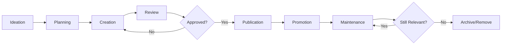

# Information Architect Best Practices

**Version:** 1.0  
**Last Updated:** 2026-02-09  
**Role:** Information Architect  
**Purpose:** Guidance for organizing, structuring, and labeling content to support usability, findability, and understanding in digital products

---

## Table of Contents

1. [Core Principles](#core-principles)
2. [Information Architecture Frameworks](#information-architecture-frameworks)
3. [Content Strategy](#content-strategy)
4. [Navigation Design](#navigation-design)
5. [Taxonomy & Metadata](#taxonomy--metadata)
6. [Search & Findability](#search--findability)
7. [User Research for IA](#user-research-for-ia)
8. [Documentation & Deliverables](#documentation--deliverables)
9. [Accessibility & Inclusive Design](#accessibility--inclusive-design)
10. [Quality Standards](#quality-standards)
11. [Integration Points](#integration-points)
12. [Tools & Methodologies](#tools--methodologies)
13. [Project Type Adaptations](#project-type-adaptations)
14. [Self-Assessment Checklist](#self-assessment-checklist)

---

## Core Principles

### 1.1 User-Centered Approach
- **Mental models:** Design systems that match users' expectations and understanding
- **Findability:** Ensure users can quickly locate information they need
- **Understandability:** Present information in clear, logical structures
- **Task completion:** Support efficient task flows and goal achievement
- **Context awareness:** Consider user context, device, and environment

### 1.2 Content Organization
- **Logical grouping:** Group related content together
- **Clear hierarchy:** Create meaningful parent-child relationships
- **Consistent labeling:** Use familiar, unambiguous terminology
- **Scalability:** Design structures that accommodate growth
- **Flexibility:** Allow for multiple access paths to content

### 1.3 Business Alignment
- **Strategic goals:** Support organizational objectives
- **Content governance:** Define ownership and maintenance processes
- **Measurement:** Track effectiveness through analytics
- **ROI focus:** Demonstrate value through improved metrics
- **Stakeholder collaboration:** Align with business requirements

---

## Information Architecture Frameworks

### 2.1 Organization Systems

**Hierarchical Structure:**
```
E-Commerce Site Structure
├── Home
├── Shop
│   ├── Women's Clothing
│   │   ├── Dresses
│   │   ├── Tops
│   │   ├── Bottoms
│   │   └── Outerwear
│   ├── Men's Clothing
│   │   ├── Shirts
│   │   ├── Pants
│   │   ├── Suits
│   │   └── Accessories
│   └── Sale
│       ├── Women's Sale
│       └── Men's Sale
├── About Us
│   ├── Our Story
│   ├── Team
│   └── Careers
├── Customer Service
│   ├── FAQs
│   ├── Shipping & Returns
│   ├── Size Guide
│   └── Contact Us
└── My Account
    ├── Order History
    ├── Saved Items
    ├── Profile Settings
    └── Payment Methods
```

**Sitemap Documentation (XML Format):**
```xml
<?xml version="1.0" encoding="UTF-8"?>
<sitemap>
  <page id="home" level="1" priority="high">
    <title>Home</title>
    <url>/</url>
    <description>Main landing page</description>
    <audience>All users</audience>
    <update-frequency>Daily</update-frequency>
  </page>
  
  <page id="shop" level="1" priority="high">
    <title>Shop</title>
    <url>/shop</url>
    <description>Product catalog</description>
    <children>
      <page id="womens" level="2" priority="high">
        <title>Women's Clothing</title>
        <url>/shop/womens</url>
        <facets>
          <facet>Category</facet>
          <facet>Size</facet>
          <facet>Color</facet>
          <facet>Price Range</facet>
          <facet>Brand</facet>
        </facets>
        <children>
          <page id="dresses" level="3">
            <title>Dresses</title>
            <url>/shop/womens/dresses</url>
            <related-categories>
              <category>Formal Wear</category>
              <category>Casual Wear</category>
            </related-categories>
          </page>
        </children>
      </page>
    </children>
  </page>
</sitemap>
```

### 2.2 Faceted Classification

**Faceted Navigation Schema:**
```yaml
# Faceted navigation for product catalog
product_facets:
  primary_facets:
    - name: Category
      type: hierarchical
      values:
        - Clothing > Women's > Dresses
        - Clothing > Men's > Shirts
        - Accessories > Bags
      display: expandable_tree
      
    - name: Price
      type: range
      values:
        - "$0 - $50"
        - "$50 - $100"
        - "$100 - $200"
        - "$200+"
      display: slider
      
    - name: Brand
      type: multi-select
      values: dynamic # From database
      display: checkbox_list
      facet_count: true
      
    - name: Size
      type: multi-select
      values:
        - XS
        - S
        - M
        - L
        - XL
        - XXL
      display: button_group
      
    - name: Color
      type: multi-select
      values: dynamic
      display: color_swatch
      
  secondary_facets:
    - name: Material
      type: multi-select
      display: dropdown
      
    - name: Rating
      type: single-select
      values:
        - "4 stars & up"
        - "3 stars & up"
        - "2 stars & up"
      display: radio_buttons
      
    - name: Availability
      type: boolean
      values:
        - "In Stock"
        - "Include Out of Stock"
      display: checkbox
      
  sorting_options:
    - Relevance
    - Price: Low to High
    - Price: High to Low
    - Newest
    - Best Selling
    - Customer Rating
    
  results_display:
    default_view: grid
    options:
      - grid
      - list
      - compact
    items_per_page: 24
    pagination_style: infinite_scroll
```

### 2.3 Content Models

**Content Type Definition:**
```json
{
  "content_type": "article",
  "version": "1.0",
  "fields": [
    {
      "name": "title",
      "type": "text",
      "required": true,
      "max_length": 120,
      "help_text": "Article headline (60-120 characters for SEO)"
    },
    {
      "name": "slug",
      "type": "slug",
      "required": true,
      "auto_generate": true,
      "source_field": "title"
    },
    {
      "name": "author",
      "type": "reference",
      "reference_to": "author",
      "required": true
    },
    {
      "name": "publish_date",
      "type": "datetime",
      "required": true,
      "default": "now"
    },
    {
      "name": "featured_image",
      "type": "media",
      "allowed_types": ["image/jpeg", "image/png", "image/webp"],
      "max_size": "5MB",
      "required": true,
      "alt_text_required": true
    },
    {
      "name": "excerpt",
      "type": "textarea",
      "required": true,
      "max_length": 300,
      "help_text": "Brief summary for listings and social sharing"
    },
    {
      "name": "body",
      "type": "rich_text",
      "required": true,
      "allowed_elements": [
        "heading2", "heading3", "paragraph", "bold", "italic",
        "link", "ordered_list", "unordered_list", "blockquote",
        "image", "embed"
      ]
    },
    {
      "name": "category",
      "type": "taxonomy",
      "taxonomy_name": "article_categories",
      "required": true,
      "cardinality": "single"
    },
    {
      "name": "tags",
      "type": "taxonomy",
      "taxonomy_name": "article_tags",
      "required": false,
      "cardinality": "multiple",
      "max_items": 5
    },
    {
      "name": "related_articles",
      "type": "reference",
      "reference_to": "article",
      "cardinality": "multiple",
      "max_items": 3
    },
    {
      "name": "seo_meta_description",
      "type": "text",
      "required": false,
      "max_length": 160
    },
    {
      "name": "status",
      "type": "select",
      "options": ["draft", "review", "scheduled", "published", "archived"],
      "default": "draft",
      "required": true
    }
  ],
  "relationships": {
    "belongs_to": ["author", "category"],
    "has_many": ["tags", "comments"],
    "references": ["related_articles"]
  },
  "workflow": {
    "draft": {
      "next_states": ["review"],
      "permissions": ["author", "editor"]
    },
    "review": {
      "next_states": ["draft", "scheduled", "published"],
      "permissions": ["editor", "publisher"]
    },
    "scheduled": {
      "next_states": ["published", "draft"],
      "permissions": ["publisher"]
    },
    "published": {
      "next_states": ["archived"],
      "permissions": ["publisher"]
    }
  }
}
```

---

## Content Strategy

### 3.1 Content Inventory & Audit

**Content Inventory Spreadsheet Template:**
```
| Page ID | URL | Title | Content Type | Owner | Last Updated | Status | Word Count | SEO Score | Traffic (30d) | Bounce Rate | Action |
|---------|-----|-------|--------------|-------|--------------|--------|------------|-----------|---------------|-------------|--------|
| P001 | /about | About Us | Static | Marketing | 2025-12-01 | Current | 450 | 85 | 2,340 | 35% | Keep |
| P002 | /products/widget-a | Product Page | Product | Product Team | 2024-06-15 | Outdated | 200 | 62 | 145 | 68% | Update |
| P003 | /blog/old-post | Blog Post | Article | Content Team | 2023-03-20 | Archived | 800 | 45 | 12 | 85% | Archive |
```

**Content Audit Criteria:**
```yaml
audit_criteria:
  quality_assessment:
    - accuracy: "Is information correct and up-to-date?"
    - relevance: "Does it serve user needs?"
    - clarity: "Is it easy to understand?"
    - completeness: "Are there gaps in information?"
    - tone: "Is it consistent with brand voice?"
    
  performance_metrics:
    - page_views: 30_day_average
    - bounce_rate: acceptable_threshold_60_percent
    - time_on_page: minimum_2_minutes
    - conversion_rate: track_if_applicable
    - search_ranking: top_10_for_target_keywords
    
  technical_health:
    - broken_links: 0_tolerance
    - image_optimization: all_images_under_200kb
    - mobile_responsiveness: fully_responsive
    - load_time: under_3_seconds
    - accessibility_score: wcag_aa_compliance
    
  recommendations:
    keep:
      - High quality + High performance
      - Strategic importance
    update:
      - Outdated information
      - Poor SEO performance
      - Accessibility issues
    consolidate:
      - Duplicate content
      - Overlapping topics
    archive:
      - No longer relevant
      - Extremely low traffic
      - Outdated and superseded
    delete:
      - Broken beyond repair
      - Legal/compliance issues
      - No strategic value
```

### 3.2 Content Lifecycle Management

**Content Workflow:**


**Governance Model:**
```yaml
content_governance:
  roles:
    content_strategist:
      responsibilities:
        - Define content strategy
        - Establish standards
        - Conduct audits
        - Measure effectiveness
        
    content_owner:
      responsibilities:
        - Subject matter expertise
        - Content accuracy
        - Update schedule
        - Stakeholder liaison
        
    editor:
      responsibilities:
        - Quality review
        - Style guide enforcement
        - SEO optimization
        - Publication approval
        
    content_creator:
      responsibilities:
        - Research and writing
        - Image sourcing
        - Metadata completion
        - Revision implementation
        
  policies:
    review_cycle:
      high_priority: every_3_months
      medium_priority: every_6_months
      low_priority: annually
      
    quality_standards:
      - Follow style guide
      - Pass accessibility check
      - Meet SEO requirements
      - Include required metadata
      - Obtain legal review (when needed)
      
    retirement_criteria:
      - No views in 6 months
      - Outdated by >2 years
      - Superseded by newer content
      - Legal requirement to remove
```

---

## Navigation Design

### 4.1 Global Navigation Pattern

**Primary Navigation Structure:**
```html
<!-- Mega Menu Example -->
<nav class="primary-navigation" role="navigation" aria-label="Main menu">
  <ul class="nav-level-1">
    <li class="nav-item has-submenu">
      <a href="/products" aria-haspopup="true" aria-expanded="false">
        Products
        <span class="icon-chevron-down" aria-hidden="true"></span>
      </a>
      
      <!-- Mega Menu -->
      <div class="mega-menu" role="menu">
        <div class="mega-menu-column">
          <h3 class="mega-menu-heading">By Category</h3>
          <ul role="none">
            <li role="menuitem"><a href="/products/software">Software</a></li>
            <li role="menuitem"><a href="/products/hardware">Hardware</a></li>
            <li role="menuitem"><a href="/products/services">Services</a></li>
          </ul>
        </div>
        
        <div class="mega-menu-column">
          <h3 class="mega-menu-heading">By Industry</h3>
          <ul role="none">
            <li role="menuitem"><a href="/industries/healthcare">Healthcare</a></li>
            <li role="menuitem"><a href="/industries/finance">Finance</a></li>
            <li role="menuitem"><a href="/industries/retail">Retail</a></li>
          </ul>
        </div>
        
        <div class="mega-menu-column mega-menu-featured">
          <h3 class="mega-menu-heading">Featured</h3>
          <a href="/products/new-release" class="featured-product">
            
            <span>Introducing Product X</span>
          </a>
        </div>
      </div>
    </li>
    
    <li class="nav-item">
      <a href="/solutions">Solutions</a>
    </li>
    
    <li class="nav-item">
      <a href="/resources">Resources</a>
    </li>
    
    <li class="nav-item">
      <a href="/support">Support</a>
    </li>
  </ul>
  
  <!-- Utility Navigation -->
  <ul class="nav-utility">
    <li><a href="/search" aria-label="Search"><span class="icon-search"></span></a></li>
    <li><a href="/account" aria-label="My Account"><span class="icon-user"></span></a></li>
    <li><a href="/cart" aria-label="Shopping Cart"><span class="icon-cart"></span></a></li>
  </ul>
</nav>
```

**Mobile Navigation Pattern:**
```html
<!-- Hamburger Menu with Accordion -->
<nav class="mobile-navigation" role="navigation">
  <button class="menu-toggle" 
          aria-expanded="false" 
          aria-controls="mobile-menu"
          aria-label="Open menu">
    <span class="hamburger-icon" aria-hidden="true"></span>
  </button>
  
  <div id="mobile-menu" class="mobile-menu" hidden>
    <div class="mobile-menu-header">
      <button class="close-menu" aria-label="Close menu">
        <span class="icon-close" aria-hidden="true"></span>
      </button>
    </div>
    
    <ul class="mobile-nav-list">
      <li class="mobile-nav-item">
        <button class="accordion-trigger" 
                aria-expanded="false" 
                aria-controls="products-menu">
          Products
          <span class="icon-chevron" aria-hidden="true"></span>
        </button>
        <ul id="products-menu" class="submenu" hidden>
          <li><a href="/products/software">Software</a></li>
          <li><a href="/products/hardware">Hardware</a></li>
          <li><a href="/products/services">Services</a></li>
        </ul>
      </li>
      
      <li class="mobile-nav-item">
        <a href="/solutions">Solutions</a>
      </li>
      
      <li class="mobile-nav-item">
        <a href="/resources">Resources</a>
      </li>
    </ul>
  </div>
</nav>
```

### 4.2 Breadcrumbs

**Structured Breadcrumb Implementation:**
```html
<nav aria-label="Breadcrumb" class="breadcrumb">
  <ol itemscope itemtype="https://schema.org/BreadcrumbList">
    <li itemprop="itemListElement" 
        itemscope 
        itemtype="https://schema.org/ListItem">
      <a itemprop="item" href="/">
        <span itemprop="name">Home</span>
      </a>
      <meta itemprop="position" content="1" />
    </li>
    
    <li itemprop="itemListElement" 
        itemscope 
        itemtype="https://schema.org/ListItem">
      <a itemprop="item" href="/shop">
        <span itemprop="name">Shop</span>
      </a>
      <meta itemprop="position" content="2" />
    </li>
    
    <li itemprop="itemListElement" 
        itemscope 
        itemtype="https://schema.org/ListItem">
      <a itemprop="item" href="/shop/womens">
        <span itemprop="name">Women's Clothing</span>
      </a>
      <meta itemprop="position" content="3" />
    </li>
    
    <li itemprop="itemListElement" 
        itemscope 
        itemtype="https://schema.org/ListItem"
        aria-current="page">
      <span itemprop="name">Dresses</span>
      <meta itemprop="position" content="4" />
    </li>
  </ol>
</nav>
```

### 4.3 Contextual Navigation

**Related Content Recommendations:**
```yaml
contextual_navigation_rules:
  product_detail_page:
    primary_ctas:
      - Add to Cart
      - Add to Wishlist
      - Share
      
    related_sections:
      - type: similar_products
        algorithm: collaborative_filtering
        title: "Customers also viewed"
        count: 4
        
      - type: complementary_products
        algorithm: frequently_bought_together
        title: "Complete the look"
        count: 3
        
      - type: category_bestsellers
        filter: same_category
        title: "Best sellers in [Category]"
        count: 4
        
    navigation_aids:
      - Back to category listing
      - View all from this brand
      - Size guide (modal)
      - Shipping information
      
  article_page:
    related_sections:
      - type: same_author
        title: "More from [Author Name]"
        count: 3
        
      - type: same_category
        title: "Related Articles"
        count: 4
        sort_by: published_date_desc
        
      - type: popular_content
        title: "Trending Now"
        count: 5
        time_window: 7_days
        
    navigation_aids:
      - Table of contents (for long articles)
      - Back to blog home
      - Browse by category
      - Newsletter signup
```

---

## Taxonomy & Metadata

### 5.1 Controlled Vocabulary

**Taxonomy Structure:**
```yaml
taxonomy: product_categories
type: hierarchical
description: "Product classification system"

terms:
  - id: CAT001
    name: Electronics
    parent: null
    synonyms: 
      - "Electronic Devices"
      - "Tech Products"
    description: "Electronic devices and accessories"
    children:
      - id: CAT001_1
        name: Computers
        parent: CAT001
        synonyms:
          - "PCs"
          - "Laptops"
        children:
          - id: CAT001_1_1
            name: Laptops
            parent: CAT001_1
            
          - id: CAT001_1_2
            name: Desktops
            parent: CAT001_1
            
      - id: CAT001_2
        name: Mobile Devices
        parent: CAT001
        children:
          - id: CAT001_2_1
            name: Smartphones
            parent: CAT001_2
            
          - id: CAT001_2_2
            name: Tablets
            parent: CAT001_2

---

taxonomy: article_tags
type: flat
description: "Article topic tags"
cardinality: multiple

terms:
  - name: "Machine Learning"
    slug: "machine-learning"
    related_tags:
      - "Artificial Intelligence"
      - "Data Science"
      - "Neural Networks"
      
  - name: "Web Development"
    slug: "web-development"
    related_tags:
      - "Frontend"
      - "Backend"
      - "Full Stack"
      
  - name: "Cloud Computing"
    slug: "cloud-computing"
    related_tags:
      - "AWS"
      - "Azure"
      - "DevOps"
```

### 5.2 Metadata Schema

**Comprehensive Metadata Template:**
```json
{
  "metadata_schema": {
    "required_fields": {
      "title": {
        "type": "text",
        "max_length": 60,
        "guidelines": "Primary heading, include primary keyword"
      },
      "description": {
        "type": "text",
        "max_length": 160,
        "guidelines": "Meta description for search results"
      },
      "canonical_url": {
        "type": "url",
        "guidelines": "Preferred URL for duplicate content"
      },
      "content_type": {
        "type": "select",
        "options": ["article", "product", "page", "video", "podcast"],
        "guidelines": "Primary content classification"
      },
      "publish_date": {
        "type": "datetime",
        "format": "ISO 8601"
      },
      "author": {
        "type": "reference",
        "reference_to": "authors"
      }
    },
    
    "recommended_fields": {
      "featured_image": {
        "type": "media",
        "recommended_size": "1200x630",
        "format": ["jpg", "png", "webp"],
        "alt_text_required": true
      },
      "category": {
        "type": "taxonomy",
        "taxonomy": "primary_categories",
        "cardinality": "single"
      },
      "tags": {
        "type": "taxonomy",
        "taxonomy": "content_tags",
        "cardinality": "multiple",
        "max_items": 5
      },
      "reading_time": {
        "type": "integer",
        "unit": "minutes",
        "auto_calculate": true
      }
    },
    
    "seo_fields": {
      "meta_title": {
        "type": "text",
        "max_length": 60,
        "fallback": "title"
      },
      "meta_description": {
        "type": "text",
        "max_length": 160,
        "fallback": "description"
      },
      "focus_keyword": {
        "type": "text",
        "guidelines": "Primary SEO keyword"
      },
      "robots": {
        "type": "select",
        "options": ["index,follow", "noindex,follow", "index,nofollow", "noindex,nofollow"],
        "default": "index,follow"
      }
    },
    
    "social_media_fields": {
      "og_title": {
        "type": "text",
        "max_length": 60,
        "fallback": "title",
        "platform": "Facebook/LinkedIn"
      },
      "og_description": {
        "type": "text",
        "max_length": 200,
        "fallback": "description",
        "platform": "Facebook/LinkedIn"
      },
      "og_image": {
        "type": "media",
        "recommended_size": "1200x630",
        "fallback": "featured_image",
        "platform": "Facebook/LinkedIn"
      },
      "twitter_title": {
        "type": "text",
        "max_length": 70,
        "fallback": "title",
        "platform": "Twitter/X"
      },
      "twitter_description": {
        "type": "text",
        "max_length": 200,
        "fallback": "description",
        "platform": "Twitter/X"
      },
      "twitter_image": {
        "type": "media",
        "recommended_size": "1200x675",
        "fallback": "featured_image",
        "platform": "Twitter/X"
      },
      "twitter_card": {
        "type": "select",
        "options": ["summary", "summary_large_image"],
        "default": "summary_large_image"
      }
    }
  }
}
```

---

## Search & Findability

### 6.1 Search Strategy

**Search Configuration:**
```yaml
search_configuration:
  indexing:
    indexed_content_types:
      - products
      - articles
      - pages
      - help_docs
      
    indexed_fields:
      products:
        title:
          weight: 10
          analyzer: standard
        description:
          weight: 5
          analyzer: english
        sku:
          weight: 8
          analyzer: keyword
        brand:
          weight: 3
          analyzer: keyword
        tags:
          weight: 2
          analyzer: keyword
          
      articles:
        title:
          weight: 10
          analyzer: english
        body:
          weight: 5
          analyzer: english
        excerpt:
          weight: 7
          analyzer: english
        author:
          weight: 2
          analyzer: keyword
        tags:
          weight: 3
          analyzer: keyword
          
  search_features:
    autocomplete:
      enabled: true
      min_characters: 2
      max_suggestions: 8
      categories:
        - Popular searches
        - Products
        - Articles
        
    spell_check:
      enabled: true
      max_distance: 2 # Levenshtein distance
      
    synonyms:
      enabled: true
      synonym_groups:
        - ["laptop", "notebook", "portable computer"]
        - ["smartphone", "mobile phone", "cell phone"]
        - ["sneakers", "trainers", "athletic shoes"]
        
    filters:
      - name: content_type
        type: checkbox
        position: sidebar
        
      - name: date_range
        type: date_picker
        position: sidebar
        
      - name: price_range
        type: slider
        position: sidebar
        content_types: [products]
        
    results:
      default_sort: relevance
      sort_options:
        - Relevance
        - Newest First
        - Price: Low to High
        - Price: High to Low
        - Alphabetical
        
      results_per_page: 20
      pagination: numbered # or infinite_scroll
      
      highlighting:
        enabled: true
        pre_tag: "<mark>"
        post_tag: "</mark>"
        
  analytics:
    track_queries: true
    track_zero_results: true
    track_click_through_rate: true
    report_frequency: weekly
```

### 6.2 Zero-Results Page

**No Results Found Template:**
```html
<div class="search-zero-results">
  <div class="zero-results-header">
    <h1>No results found for "<span class="query-term">{search_query}</span>"</h1>
    <p>We couldn't find any matches. Try these suggestions:</p>
  </div>
  
  <div class="search-suggestions">
    <div class="suggestion-section">
      <h2>Check your spelling</h2>
      <p>Did you mean: <strong>{suggested_query}</strong>?</p>
      <button>Search for {suggested_query}</button>
    </div>
    
    <div class="suggestion-section">
      <h2>Try different keywords</h2>
      <ul>
        <li>Use more general terms</li>
        <li>Try synonyms or alternative phrases</li>
        <li>Remove filters to broaden your search</li>
      </ul>
    </div>
    
    <div class="suggestion-section">
      <h2>Browse popular categories</h2>
      <ul class="category-links">
        <li><a href="/products/electronics">Electronics</a></li>
        <li><a href="/products/clothing">Clothing</a></li>
        <li><a href="/products/home">Home & Garden</a></li>
      </ul>
    </div>
    
    <div class="suggestion-section">
      <h2>Popular searches</h2>
      <div class="popular-searches">
        <a href="/search?q=wireless+headphones" class="search-tag">Wireless Headphones</a>
        <a href="/search?q=running+shoes" class="search-tag">Running Shoes</a>
        <a href="/search?q=laptop+bag" class="search-tag">Laptop Bag</a>
      </div>
    </div>
  </div>
  
  <div class="help-section">
    <h2>Still can't find what you're looking for?</h2>
    <a href="/contact" class="btn-primary">Contact Support</a>
  </div>
</div>
```

---

## User Research for IA

### 7.1 Card Sorting

**Card Sorting Study Plan:**
```yaml
study_design:
  method: open_card_sort # or closed, hybrid
  objective: "Understand how users naturally group and label product categories"
  
  participants:
    target: 30
    criteria:
      - Regular online shoppers
      - Age 25-55
      - Mix of gender
      - Varied technical proficiency
      
  cards:
    total_count: 50
    content: Product names and brief descriptions
    randomization: true
    
  process:
    platform: OptimalSort # or UserZoom, TreeJack
    duration: 20-30 minutes
    compensation: $20 gift card
    
  instructions: |
    We want to understand how you would organize these products.
    
    1. Read through all the cards
    2. Group cards that belong together
    3. Name each group
    4. You can create as many or as few groups as you like
    5. Think out loud as you work
    
  analysis:
    metrics:
      - Standardized category names
      - Agreement rate (how often items grouped together)
      - Dendrograms (hierarchical clustering)
      - Similarity matrix
      
    deliverables:
      - Recommended category structure
      - Category naming recommendations
      - Insights report
      - Presentation to stakeholders
```

### 7.2 Tree Testing

**Tree Test Protocol:**
```yaml
tree_testing:
  objective: "Validate proposed IA structure for findability"
  
  tree_structure: # Simplified for example
    - Home
    - Shop:
        - Women's:
            - Clothing
            - Shoes
            - Accessories
        - Men's:
            - Clothing
            - Shoes
            - Accessories
    - Sale
    - About Us
    - Support
    
  tasks:
    - id: T1
      description: "You want to buy a women's summer dress. Where would you look?"
      correct_path: Shop > Women's > Clothing
      
    - id: T2
      description: "You need to check the status of your order. Where would you go?"
      correct_path: Support (or My Account if available)
      
    - id: T3
      description: "You're looking for discounted men's shoes. Where would you look?"
      correct_path: Sale (or Shop > Men's > Shoes)
      
    - id: T4
      description: "You want to learn about the company's history. Where would you go?"
      correct_path: About Us
      
  participants:
    target: 50
    recruitment: UserTesting.com panel
    
  success_criteria:
    direct_success_rate: ">75%"
    directness_score: ">0.7"
    time_to_complete: "<30 seconds per task"
    
  analysis:
    - Success/failure rates per task
    - Common wrong paths (identify problem areas)
    - Time taken per task
    - First-click analysis
    - Drop-off points
```

### 7.3 User Journey Mapping

**Journey Map Template:**
```markdown
## User Journey: First-Time Product Purchase

### Persona: Sarah, 32, Marketing Manager
**Goal:** Purchase running shoes for marathon training
**Context:** Desktop, during lunch break

---

### Journey Stages

#### 1. Awareness
**Actions:**
- Searches Google for "best running shoes for marathons"
- Clicks on our blog article from search results

**Touchpoints:**
- Google SERP
- Blog article

**Thoughts:**
- "I need expert advice on choosing the right shoes"

**Pain Points:**
- Overwhelmed by options
- Unsure where to start

**IA Opportunities:**
- Clear path from article to product pages
- Embedded product recommendations in content
- "Shop now" CTAs in context

---

#### 2. Research
**Actions:**
- Reads buying guide
- Navigates to women's running shoes category
- Uses filters (size, price, brand)
- Compares 3 products

**Touchpoints:**
- Buying guide
- Category page
- Product listing page
- Product detail pages
- Comparison tool

**Thoughts:**
- "Which features matter most?"
- "Are these reviews trustworthy?"

**Pain Points:**
- Too many filtering options
- Difficulty comparing products
- Unclear sizing information

**IA Opportunities:**
- Simplified, progressive filtering
- Side-by-side comparison feature
- Prominent size guide link
- Review summary with verified purchases

---

#### 3. Decision
**Actions:**
- Adds product to cart
- Checks shipping options
- Looks for promo codes
- Creates account

**Touchpoints:**
- Product page
- Add to cart button
- Cart page
- Checkout

**Thoughts:**
- "Is free shipping available?"
- "Should I create an account now?"

**Pain Points:**
- Forced account creation
- Hidden shipping costs
- Promo code field creates doubt

**IA Opportunities:**
- Guest checkout option
- Clear shipping info on product page
- Contextual help during checkout
- Save cart for later (with/without account)

---

#### 4. Purchase
**Actions:**
- Enters shipping information
- Selects payment method
- Reviews order
- Completes purchase

**Touchpoints:**
- Checkout flow
- Payment page
- Order confirmation

**Thoughts:**
- "Is my information secure?"
- "How long will shipping take?"

**Pain Points:**
- Too many form fields
- Unclear security indicators
- Delivery estimate not prominent

**IA Opportunities:**
- Progressive disclosure in forms
- Security badges
- Clear delivery timeline
- Order summary always visible

---

#### 5. Post-Purchase
**Actions:**
- Receives confirmation email
- Tracks package
- Receives product
- Leaves review

**Touchpoints:**
- Confirmation email
- Shipping notification
- Order tracking page
- Product page (review)

**Thoughts:**
- "When will it arrive?"
- "How do I track my order?"

**Pain Points:**
- Difficulty finding order status
- Unclear return policy

**IA Opportunities:**
- Prominent "Track Order" in navigation
- Accessible order history
- Easy review submission
- Clear return/exchange info
```

---

## Documentation & Deliverables

### 8.1 IA Specification Document

**Document Outline:**
```markdown
# Information Architecture Specification
## [Project Name]

**Version:** 1.0  
**Date:** 2026-02-09  
**Author:** [IA Name]  
**Status:** Final

---

## Executive Summary
Brief overview of IA approach, key decisions, and expected outcomes.

## Project Context
- Business objectives
- User needs
- Technical constraints
- Timeline and resources

## Research Findings
- User research summary
- Competitive analysis
- Analytics insights
- Content audit results

## IA Approach
- Organization principles
- Navigation strategy
- Search strategy
- Taxonomy approach

## Sitemap
- Visual sitemap (link to diagram)
- Page hierarchy
- Key user paths

## Navigation Specifications
### Global Navigation
- Structure and behavior
- Desktop vs. mobile
- Accessibility requirements

### Contextual Navigation
- Related content logic
- Breadcrumbs
- Pagination

## Content Types & Templates
- Page templates
- Content models
- Metadata requirements

## Taxonomy & Classification
- Category structure
- Tagging strategy
- Controlled vocabularies

## Search Strategy
- Search scope
- Filtering and facets
- Search algorithms

## URL Structure
- Pattern conventions
- Redirect strategy
- Canonical URLs

## Responsive Considerations
- Mobile navigation
- Touch targets
- Progressive disclosure

## Accessibility
- WCAG compliance level
- Keyboard navigation
- Screen reader support

## SEO Considerations
- Schema markup
- Structured data
- Internal linking

## Measurement & Success Metrics
- KPIs
- Analytics implementation
- Testing plan

## Implementation Guidelines
- Priority phases
- Dependencies
- Migration strategy

## Appendices
- Wireframes
- User flows
- Research artifacts
```

### 8.2 Content Model Documentation

**Content Type Specification:**
```yaml
content_type: Event
description: "Upcoming events, webinars, and conferences"
icon: calendar
color: "#4A90E2"

fields:
  - name: event_title
    type: text
    required: true
    max_length: 100
    help_text: "Event name"
    admin_label: true
    
  - name: event_type
    type: select
    required: true
    options:
      - value: webinar
        label: "Webinar"
      - value: conference
        label: "Conference"
      - value: workshop
        label: "Workshop"
      - value: meetup
        label: "Meetup"
        
  - name: start_datetime
    type: datetime
    required: true
    validation:
      - must_be_future: true
      
  - name: end_datetime
    type: datetime
    required: true
    validation:
      - must_be_after: start_datetime
      
  - name: timezone
    type: select
    required: true
    options: timezones_list
    default: "America/New_York"
    
  - name: location
    type: group
    fields:
      - name: is_virtual
        type: boolean
        default: false
        
      - name: venue_name
        type: text
        conditional_display:
          when: is_virtual
          equals: false
          
      - name: street_address
        type: text
        conditional_display:
          when: is_virtual
          equals: false
          
      - name: city
        type: text
        
      - name: state
        type: select
        options: us_states
        
      - name: virtual_link
        type: url
        conditional_display:
          when: is_virtual
          equals: true
        validation:
          - valid_url: true
          
  - name: featured_image
    type: media
    required: true
    allowed_types:
      - image/jpeg
      - image/png
      - image/webp
    max_size: 2MB
    recommended_dimensions: "1200x630"
    
  - name: description
    type: rich_text
    required: true
    allowed_elements:
      - paragraph
      - heading2
      - heading3
      - bold
      - italic
      - link
      - ordered_list
      - unordered_list
      
  - name: speakers
    type: reference
    reference_to: person
    cardinality: multiple
    
  - name: registration_url
    type: url
    required: true
    validation:
      - valid_url: true
      
  - name: capacity
    type: integer
    min: 1
    help_text: "Maximum number of attendees"
    
  - name: registration_deadline
    type: datetime
    validation:
      - must_be_before: start_datetime
      
  - name: tags
    type: taxonomy
    taxonomy_name: event_topics
    cardinality: multiple
    max_items: 5
    
  - name: target_audience
    type: select
    cardinality: multiple
    options:
      - "Developers"
      - "Designers"
      - "Product Managers"
      - "Executives"
      - "Students"
      
display_settings:
  list_view:
    - event_title
    - event_type
    - start_datetime
    - location.city
    
  card_view:
    image: featured_image
    title: event_title
    metadata:
      - start_datetime
      - event_type
      - location.city
      
search_settings:
  searchable_fields:
    - event_title: weight_10
    - description: weight_5
    - speakers.name: weight_3
    
  facets:
    - event_type
    - location.city
    - tags
    - target_audience
    
  sort_options:
    - start_datetime_asc: "Soonest First"
    - start_datetime_desc: "Latest First"
    - event_title_asc: "Alphabetical"
```

---

## Accessibility & Inclusive Design

### 9.1 WCAG Compliance Checklist

**Level AA Compliance:**
```yaml
perceivable:
  text_alternatives:
    - [ ] All images have descriptive alt text
    - [ ] Decorative images marked with empty alt=""
    - [ ] Complex images have long descriptions
    - [ ] Form inputs have associated labels
    
  time_based_media:
    - [ ] Videos have captions
    - [ ] Audio content has transcripts
    - [ ] Auto-playing media can be paused
    
  adaptable:
    - [ ] Content structure uses semantic HTML
    - [ ] Reading order is logical
    - [ ] Instructions don't rely solely on sensory characteristics
    - [ ] Content readable without CSS
    
  distinguishable:
    - [ ] Color contrast ratio minimum 4.5:1 for text
    - [ ] Color contrast ratio minimum 3:1 for large text
    - [ ] Color not sole means of conveying information
    - [ ] Text resizable up to 200% without loss of functionality
    - [ ] Text content maximum 80 characters per line
    
operable:
  keyboard_accessible:
    - [ ] All functionality available via keyboard
    - [ ] No keyboard traps
    - [ ] Skip navigation links provided
    - [ ] Keyboard focus visible
    
  enough_time:
    - [ ] Time limits can be extended/disabled
    - [ ] Auto-updating content can be paused
    - [ ] Sessions don't timeout without warning
    
  seizures:
    - [ ] No content flashes more than 3 times per second
    
  navigable:
    - [ ] Descriptive page titles
    - [ ] Logical focus order
    - [ ] Link purpose clear from text or context
    - [ ] Multiple ways to find pages
    - [ ] Headings and labels descriptive
    - [ ] Current focus visible
    
understandable:
  readable:
    - [ ] Language of page identified
    - [ ] Language of parts identified when different
    - [ ] Unusual words explained
    - [ ] Abbreviations explained
    
  predictable:
    - [ ] Focus doesn't cause unexpected context changes
    - [ ] Input doesn't cause unexpected context changes
    - [ ] Navigation consistent across pages
    - [ ] Components identified consistently
    
  input_assistance:
    - [ ] Error messages identify and describe errors
    - [ ] Form labels and instructions provided
    - [ ] Error suggestions provided
    - [ ] Error prevention for legal/financial transactions
    
robust:
  compatible:
    - [ ] Valid HTML markup
    - [ ] Elements have complete start/end tags
    - [ ] Elements properly nested
    - [ ] IDs unique on page
    - [ ] ARIA roles, states, properties valid
```

### 9.2 Inclusive Design Patterns

**Multi-Language Support:**
```yaml
internationalization:
  language_selector:
    placement: header
    type: dropdown # or inline links for few languages
    display: 
      - language_name_native: "English"
      - flag_icon: optional # avoid relying solely on flags
      
  url_structure:
    pattern: "/{language-code}/path"
    examples:
      - "/en/products"
      - "/es/productos"
      - "/fr/produits"
      
  content_strategy:
    translation_method: professional # or machine, hybrid
    maintain_consistency: true
    cultural_adaptation: true
    
  rtl_languages:
    supported: ["ar", "he", "fa"]
    css_handling: logical_properties
    mirroring: interface_elements
    
  date_time:
    format: locale_specific
    timezone: user_preference
    
  currency:
    display: user_location
    conversion: realtime_rates
```

---

## Quality Standards

### 10.1 IA Heuristics

**Evaluation Criteria:**
```yaml
findability:
  - Can users locate content within 3 clicks?
  - Are navigation labels clear and unambiguous?
  - Is search functionality effective?
  - Are breadcrumbs implemented correctly?
  - Is there more than one path to key content?
  
understandability:
  - Are category names user-friendly?
  - Is hierarchy logical and intuitive?
  - Are relationships between content clear?
  - Is terminology consistent throughout?
  
efficiency:
  - Can frequent tasks be completed quickly?
  - Are shortcuts available for power users?
  - Is content appropriately chunked?
  - Are cognitive loads minimized?
  
scalability:
  - Can structure accommodate growth?
  - Are patterns reusable?
  - Is maintenance sustainable?
  - Are there clear governance rules?
  
accessibility:
  - Is structure perceivable to all users?
  - Can navigation be operated without mouse?
  - Are all users represented in personas?
  - Does IA support assistive technologies?
```

### 10.2 Testing & Validation

**IA Testing Methods:**
```yaml
testing_approaches:
  tree_testing:
    when: Before visual design
    purpose: Validate hierarchy and labels
    sample_size: 30-50 users
    
  first_click_testing:
    when: After initial design
    purpose: Validate information scent
    sample_size: 20-30 users per variant
    
  task_analysis:
    when: Throughout design
    purpose: Verify task completion rates
    metrics:
      - Success rate
      - Time on task
      - Error rate
      
  analytics_review:
    when: Post-launch
    purpose: Validate real-world usage
    metrics:
      - Navigation paths
      - Search queries
      - Bounce rates
      - Exit pages
      
  heuristic_evaluation:
    when: Regular intervals
    purpose: Expert review
    evaluators: 3-5 IA specialists
    
success_metrics:
  quantitative:
    - Task success rate > 80%
    - Time to complete key tasks reduced by 25%
    - Search success rate > 70%
    - Bounce rate < 40%
    - Pages per session > 3
    
  qualitative:
    - User satisfaction score > 4/5
    - Ease of navigation rating > 4/5
    - Net Promoter Score improvement
    - Reduced support tickets
```

---

## Integration Points

### 11.1 With UX/UI Designer
- **Wireframes:** Translate IA into visual layouts
- **Navigation:** Design menu interactions and patterns
- **Content hierarchy:** Apply visual hierarchy
- **Responsive design:** Adapt IA for different screens

### 11.2 With Content Strategist
- **Content models:** Define structure and relationships
- **Taxonomy:** Develop classification systems
- **Metadata:** Specify required fields
- **Governance:** Establish maintenance processes

### 11.3 With SEO Specialist
- **URL structure:** Optimize for search engines
- **Internal linking:** Create link architecture
- **Schema markup:** Implement structured data
- **Content hierarchy:** Support crawlability

### 11.4 With Front-End Developer
- **Semantic HTML:** Ensure proper markup
- **Navigation code:** Implement accessible patterns
- **Search functionality:** Build search features
- **Breadcrumbs:** Code hierarchical navigation

---

## Tools & Methodologies

### 12.1 IA Tools
- **Diagramming:** Lucidchart, Miro, Figma FigJam
- **Card sorting:** OptimalSort, UserZoom
- **Tree testing:** Treejack, UserZoom
- **Prototyping:** Axure, Figma, Adobe XD
- **Analytics:** Google Analytics, Hotjar

### 12.2 Documentation Tools
- **Sitemaps:** Slickplan, Dynomapper
- **Content modeling:** ContentModel.io, Airtable
- **Taxonomies:** Synaptica, TopQuadrant
- **Specifications:** Confluence, Notion

---

## Project Type Adaptations

### 13.1 E-Commerce
- Complex product taxonomies
- Faceted navigation
- Personalized recommendations
- Multi-path browsing

### 13.2 Content Publishing
- Editorial calendar integration
- Author/topic taxonomies
- Content relationships
- Article discovery

### 13.3 Enterprise Applications
- Role-based navigation
- Workflow-oriented IA
- Task-based organization
- Dashboard design

### 13.4 Educational Platforms
- Learning path structure
- Progressive disclosure
- Resource organization
- Skill-based navigation

---

## Self-Assessment Checklist

### 14.1 Research Skills
- [ ] Conduct effective user research
- [ ] Analyze user behavior data
- [ ] Perform competitive analysis
- [ ] Run card sorting studies
- [ ] Execute tree testing

### 14.2 Design Skills
- [ ] Create logical hierarchies
- [ ] Design navigation systems
- [ ] Develop taxonomies
- [ ] Define metadata schemas
- [ ] Model content structures

### 14.3 Documentation
- [ ] Create clear sitemaps
- [ ] Write IA specifications
- [ ] Document content models
- [ ] Produce user flows
- [ ] Maintain IA guidelines

### 14.4 Collaboration
- [ ] Communicate IA decisions
- [ ] Present to stakeholders
- [ ] Work with cross-functional teams
- [ ] Advocate for users
- [ ] Facilitate workshops

---

**Document Control:**
- Review quarterly
- Update with new patterns
- Incorporate user feedback
- Align with team standards

---

*Living document - contribute improvements through team's standard process.*
