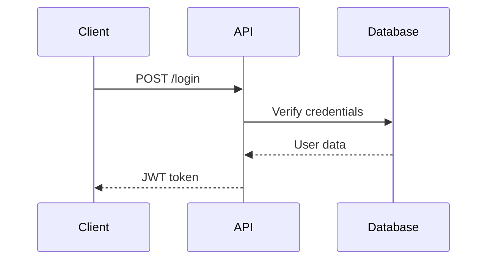
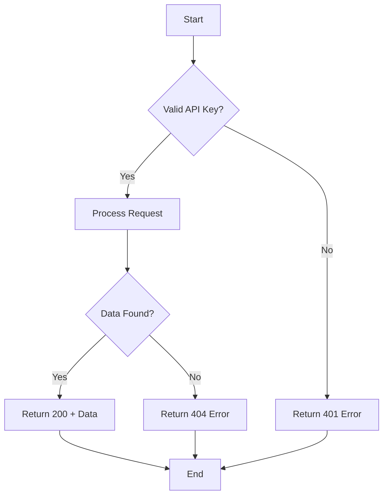

# Technical Writer Best Practices

**Version:** 1.0  
**Last Updated:** 2026-02-09  
**Role:** Technical Writer  
**Purpose:** Guidance for creating clear, accurate, and user-centered technical documentation that enables users to successfully accomplish their goals

---

## Table of Contents

1. [Core Principles](#core-principles)
2. [Documentation Planning](#documentation-planning)
3. [Writing Style & Voice](#writing-style--voice)
4. [Document Structure](#document-structure)
5. [API Documentation](#api-documentation)
6. [User Guides & Tutorials](#user-guides--tutorials)
7. [Technical Specifications](#technical-specifications)
8. [Visual Communication](#visual-communication)
9. [Documentation Tools & Workflows](#documentation-tools--workflows)
10. [Quality Standards](#quality-standards)
11. [Integration Points](#integration-points)
12. [Tools & Technologies](#tools--technologies)
13. [Project Type Adaptations](#project-type-adaptations)
14. [Self-Assessment Checklist](#self-assessment-checklist)

---

## Core Principles

### 1.1 User-Centered Writing
- **Know your audience:** Understand technical level, goals, and context
- **Task-oriented:** Focus on what users need to accomplish
- **Clarity over cleverness:** Use simple, direct language
- **Accuracy:** Ensure technical correctness through SME review
- **Completeness:** Provide all necessary information without overwhelming

### 1.2 Information Architecture
- **Logical organization:** Structure content for easy navigation
- **Findability:** Make information searchable and discoverable
- **Consistency:** Apply uniform patterns and terminology
- **Progressive disclosure:** Start simple, provide details on demand
- **Cross-referencing:** Link related concepts effectively

### 1.3 Continuous Improvement
- **Feedback loops:** Collect and act on user feedback
- **Metrics tracking:** Monitor documentation usage and effectiveness
- **Version control:** Track changes and maintain history
- **Regular reviews:** Keep documentation current and accurate
- **Collaboration:** Work closely with development and product teams

---

## Documentation Planning

### 2.1 Documentation Strategy

**Documentation Plan Template:**
```yaml
project: Product XYZ Documentation
version: 2.0
date: 2026-02-09

stakeholders:
  product_owner: Jane Smith
  engineering_lead: John Doe
  technical_writer: Alice Johnson
  reviewers:
    - Development Team
    - QA Team
    - Support Team

audience_analysis:
  primary_users:
    - name: Developer
      technical_level: Advanced
      goals:
        - Integrate API quickly
        - Understand capabilities
        - Troubleshoot issues
      pain_points:
        - Complex authentication
        - Rate limiting
        
    - name: End User
      technical_level: Beginner to Intermediate
      goals:
        - Complete common tasks
        - Learn features
        - Solve problems independently
      pain_points:
        - Finding relevant help
        - Understanding terminology

documentation_types:
  - type: API Reference
    priority: High
    owner: Technical Writer
    timeline: 2 weeks
    format: OpenAPI/Swagger
    
  - type: Getting Started Guide
    priority: High
    owner: Technical Writer
    timeline: 1 week
    format: Markdown
    
  - type: User Guide
    priority: Medium
    owner: Technical Writer
    timeline: 3 weeks
    format: Markdown
    
  - type: Tutorial Videos
    priority: Low
    owner: Content Team
    timeline: 4 weeks
    format: Video (MP4)
    
  - type: Release Notes
    priority: High
    owner: Product Manager + Technical Writer
    timeline: Ongoing
    format: Markdown

content_inventory:
  existing_documentation:
    - API docs v1.0 (needs update)
    - User guide v1.5 (partially outdated)
    - FAQ (scattered, needs consolidation)
    
  gaps:
    - Migration guide from v1 to v2
    - Troubleshooting guide
    - Code samples repository
    - Architecture overview

success_metrics:
  - Documentation coverage: 100% of features
  - Time to first successful API call: < 15 minutes
  - Support ticket reduction: 30%
  - User satisfaction score: > 4.5/5
  - Documentation findability: > 90%

milestones:
  - date: 2026-02-16
    deliverable: API Reference complete
  - date: 2026-02-23
    deliverable: Getting Started Guide complete
  - date: 2026-03-09
    deliverable: Full User Guide complete
  - date: 2026-03-16
    deliverable: Migration Guide complete
```

### 2.2 Content Audit

**Documentation Audit Checklist:**
```markdown
## Documentation Audit: [Doc Title]

**Date:** 2026-02-09  
**Auditor:** [Name]  
**Last Updated:** [Date from document]

### 1. Accuracy
- [ ] Information is technically correct
- [ ] Code samples execute without errors
- [ ] Screenshots match current UI
- [ ] Links are not broken
- [ ] Version-specific information is labeled

### 2. Completeness
- [ ] All features are documented
- [ ] Prerequisites are listed
- [ ] Examples cover common use cases
- [ ] Error messages are explained
- [ ] Troubleshooting section exists

### 3. Clarity
- [ ] Language is appropriate for audience
- [ ] Jargon is explained or avoided
- [ ] Steps are clear and actionable
- [ ] Visual aids support text
- [ ] No ambiguous pronouns or references

### 4. Structure
- [ ] Logical flow and organization
- [ ] Consistent heading hierarchy
- [ ] Table of contents present (for long docs)
- [ ] Sections are properly chunked
- [ ] Related topics are cross-linked

### 5. Usability
- [ ] Easy to scan and find information
- [ ] Code is properly formatted
- [ ] Examples are copy-pasteable
- [ ] Download links work
- [ ] Search functionality returns relevant results

### 6. Accessibility
- [ ] Alt text for images
- [ ] Sufficient color contrast
- [ ] Semantic HTML structure
- [ ] Keyboard navigable
- [ ] Screen reader compatible

### Action Items
1. [Priority] [Action description] - [Owner]
2. Update screenshot on page 5 - Technical Writer
3. Add missing API endpoint documentation - Technical Writer

### Overall Rating
- Current State: ⭐⭐⭐ (3/5)
- Target State: ⭐⭐⭐⭐⭐ (5/5)
- Effort Required: Medium (8-10 hours)
```

---

## Writing Style & Voice

### 3.1 Style Guide

**Technical Writing Style Guide:**
```markdown
# Documentation Style Guide

## Voice & Tone
- **Active voice preferred:**
  - ✅ "Click the Save button"
  - ❌ "The Save button should be clicked"
  
- **Second person (you) for instructions:**
  - ✅ "You can configure settings..."
  - ❌ "The user can configure settings..."
  
- **Present tense:**
  - ✅ "The function returns a string"
  - ❌ "The function will return a string"
  
- **Imperative for procedures:**
  - ✅ "Install the package"
  - ❌ "You should install the package"

## Clarity Guidelines
- **Use simple words:**
  - utilize → use
  - facilitate → help
  - initiate → start
  
- **Avoid ambiguous words:**
  - may, might, could (vague)
  - should (use "recommended" or "must")
  
- **Be specific:**
  - ❌ "Adjust the settings as needed"
  - ✅ "Set the timeout value to 30 seconds"

## Formatting Conventions
- **Code elements:** `inline code`, ```code blocks```
- **UI elements:** **Bold** for buttons, labels, menu items
- **File paths:** `path/to/file.txt`
- **Placeholders:** `<your-api-key>` or `{variableName}`
- **URLs:** [descriptive link text](https://example.com)
- **Emphasis:** Use sparingly for *important* points

## Terminology
- **Consistent terms:**
  - login (noun), log in (verb)
  - setup (noun), set up (verb)
  - email (not e-mail)
  - website (not web site)
  
- **Avoid these:**
  - simply, just, easy (patronizing)
  - please (unnecessary in instructions)
  - obviously, clearly (condescending)

## Numbers & Dates
- **Numbers:** Spell out one through nine, use numerals for 10+
- **Dates:** February 9, 2026 (or ISO 8601: 2026-02-09)
- **Time:** 2:30 PM EST (or 24-hour: 14:30 EST)
- **Measurements:** Use standard units (MB, KB, ms, etc.)

## Lists
- **Bulleted lists:** Unordered items, no specific sequence
- **Numbered lists:** Steps, procedures, ranked items
- **Parallel structure:** All items in same grammatical form

## Punctuation
- **Oxford comma:** Yes, always use it
- **Periods in lists:** Only if items are complete sentences
- **One space after period:** Not two
```

### 3.2 Language Examples

**Before and After:**
```markdown
## ❌ Before: Unclear and Verbose

In order to be able to successfully utilize the API, you should first make sure 
that you have obtained your API credentials which can be gotten from the dashboard. 
After you've done that, then you'll want to go ahead and include the authentication 
headers in all of your requests. Basically, if you don't do this, the API won't 
work correctly and you'll get errors.

## ✅ After: Clear and Concise

To use the API:

1. Get your API credentials from the [dashboard](https://app.example.com/settings)
2. Include the authentication header in every request:
   ```
   Authorization: Bearer <your-api-key>
   ```

**Note:** Requests without authentication return a `401 Unauthorized` error.
```

---

## Document Structure

### 4.1 Standard Templates

**Getting Started Guide Template:**
```markdown
# Getting Started with [Product Name]

**Last Updated:** 2026-02-09  
**Estimated Time:** 15 minutes

## What You'll Learn
By the end of this guide, you'll be able to:
- Set up your development environment
- Make your first API call
- Handle authentication
- Understand basic concepts

## Prerequisites
Before you begin, ensure you have:
- [ ] Node.js 18+ installed ([Download](https://nodejs.org))
- [ ] A text editor (we recommend [VS Code](https://code.visualstudio.com))
- [ ] An active account ([Sign up](https://example.com/signup))
- [ ] Your API key ([Get it here](https://example.com/api-keys))

## Step 1: Install the SDK

Install the official SDK using npm:

```bash
npm install @example/sdk
```

**Expected output:**
```
+ @example/sdk@2.0.0
added 15 packages in 3s
```

## Step 2: Configure Authentication

Create a `.env` file in your project root:

```bash
# .env
API_KEY=your_api_key_here
API_SECRET=your_api_secret_here
```

**⚠️ Security Note:** Never commit `.env` files to version control. Add to `.gitignore`:
```bash
echo ".env" >> .gitignore
```

## Step 3: Make Your First Request

Create a new file `index.js`:

```javascript
const { ExampleClient } = require('@example/sdk');

// Initialize client
const client = new ExampleClient({
  apiKey: process.env.API_KEY,
  apiSecret: process.env.API_SECRET
});

// Make API call
async function main() {
  try {
    const response = await client.users.get('me');
    console.log('User:', response.data);
  } catch (error) {
    console.error('Error:', error.message);
  }
}

main();
```

Run the script:
```bash
node index.js
```

**Expected output:**
```json
{
  "id": "usr_1234567890",
  "email": "you@example.com",
  "name": "Your Name"
}
```

## Step 4: Explore Core Concepts

Now that you have a working setup, learn about:
- [Authentication Methods](./authentication.md) - API keys, OAuth, JWT
- [Rate Limiting](./rate-limiting.md) - Request quotas and best practices
- [Error Handling](./error-handling.md) - Common errors and solutions
- [Webhooks](./webhooks.md) - Real-time event notifications

## Next Steps
- 📖 [Read the full API Reference](./api-reference.md)
- 🎓 [Complete the Tutorial](./tutorial.md)
- 💬 [Join our Community](https://community.example.com)
- 🐛 [Report Issues](https://github.com/example/sdk/issues)

## Troubleshooting

### "API key invalid" Error
**Cause:** The API key is incorrect or expired.  
**Solution:** 
1. Verify your API key at [account settings](https://example.com/settings)
2. Ensure no extra spaces in `.env` file
3. Restart your application after changing `.env`

### Connection Timeout
**Cause:** Network connectivity or firewall issues.  
**Solution:**
1. Check your internet connection
2. Verify firewall allows outbound HTTPS (port 443)
3. Try setting a longer timeout:
   ```javascript
   const client = new ExampleClient({
     apiKey: process.env.API_KEY,
     timeout: 30000 // 30 seconds
   });
   ```

## Need Help?
- 📧 Email: support@example.com
- 💬 Chat: [Live support](https://example.com/support)
- 📚 Docs: [Full documentation](https://docs.example.com)
```

### 4.2 Tutorial Structure

**Tutorial Template:**
```markdown
# Tutorial: Build a [Feature Name]

**Level:** Intermediate  
**Time:** 45 minutes  
**Prerequisites:** Completed [Getting Started Guide](./getting-started.md)

## What You'll Build
In this tutorial, you'll build a real-time chat application that:
- Authenticates users
- Sends and receives messages
- Displays typing indicators
- Handles offline/online status

**Live Demo:** [See it in action](https://demo.example.com/chat)  
**Source Code:** [GitHub repository](https://github.com/example/chat-tutorial)

---

## Part 1: Project Setup (5 minutes)

### 1.1 Create New Project
```bash
mkdir chat-app && cd chat-app
npm init -y
npm install @example/sdk express socket.io
```

### 1.2 Project Structure
Create the following files:
```
chat-app/
├── server.js          # Backend server
├── public/
│   ├── index.html     # Chat interface
│   ├── style.css      # Styles
│   └── app.js         # Client-side logic
└── .env               # Configuration
```

---

## Part 2: Server Implementation (15 minutes)

### 2.1 Set Up Express Server
Create `server.js`:

```javascript
const express = require('express');
const http = require('http');
const socketIO = require('socket.io');

const app = express();
const server = http.createServer(app);
const io = socketIO(server);

// Serve static files
app.use(express.static('public'));

const PORT = process.env.PORT || 3000;
server.listen(PORT, () => {
  console.log(`Server running on http://localhost:${PORT}`);
});
```

**✓ Checkpoint:** Run `node server.js` and visit `http://localhost:3000`

### 2.2 Handle Socket Connections
Add to `server.js`:

```javascript
// Store active users
const users = new Map();

io.on('connection', (socket) => {
  console.log('New user connected:', socket.id);
  
  // User joins
  socket.on('join', (username) => {
    users.set(socket.id, { username, id: socket.id });
    
    // Broadcast to all clients
    io.emit('user-joined', {
      username,
      userId: socket.id,
      userCount: users.size
    });
  });
  
  // Handle messages
  socket.on('send-message', (message) => {
    const user = users.get(socket.id);
    
    io.emit('new-message', {
      username: user.username,
      message,
      timestamp: new Date().toISOString()
    });
  });
  
  // Handle disconnection
  socket.on('disconnect', () => {
    const user = users.get(socket.id);
    if (user) {
      users.delete(socket.id);
      io.emit('user-left', {
        username: user.username,
        userCount: users.size
      });
    }
  });
});
```

**💡 Explanation:**
- `io.on('connection')` fires when a client connects
- `socket.on()` listens for custom events from the client
- `io.emit()` broadcasts to all connected clients
- `socket.emit()` sends to specific client only

---

## Part 3: Client Implementation (20 minutes)

### 3.1 HTML Structure
Create `public/index.html`:

```html
<!DOCTYPE html>
<html lang="en">
<head>
  <meta charset="UTF-8">
  <meta name="viewport" content="width=device-width, initial-scale=1.0">
  <title>Chat App</title>
  <link rel="stylesheet" href="style.css">
</head>
<body>
  <div class="container">
    <!-- Login Screen -->
    <div id="login-screen">
      <h1>Join Chat</h1>
      <input type="text" id="username-input" placeholder="Enter your name">
      <button id="join-btn">Join</button>
    </div>
    
    <!-- Chat Screen -->
    <div id="chat-screen" class="hidden">
      <div class="header">
        <h2>Chat Room</h2>
        <span id="user-count">0 users online</span>
      </div>
      
      <div id="messages"></div>
      
      <div class="input-area">
        <input type="text" id="message-input" placeholder="Type a message...">
        <button id="send-btn">Send</button>
      </div>
    </div>
  </div>
  
  <script src="/socket.io/socket.io.js"></script>
  <script src="app.js"></script>
</body>
</html>
```

### 3.2 Client JavaScript
Create `public/app.js`:

```javascript
const socket = io();

// DOM elements
const loginScreen = document.getElementById('login-screen');
const chatScreen = document.getElementById('chat-screen');
const usernameInput = document.getElementById('username-input');
const joinBtn = document.getElementById('join-btn');
const messagesDiv = document.getElementById('messages');
const messageInput = document.getElementById('message-input');
const sendBtn = document.getElementById('send-btn');
const userCount = document.getElementById('user-count');

let username = '';

// Join chat
joinBtn.addEventListener('click', () => {
  username = usernameInput.value.trim();
  
  if (username) {
    socket.emit('join', username);
    loginScreen.classList.add('hidden');
    chatScreen.classList.remove('hidden');
    messageInput.focus();
  }
});

// Send message
function sendMessage() {
  const message = messageInput.value.trim();
  
  if (message) {
    socket.emit('send-message', message);
    messageInput.value = '';
  }
}

sendBtn.addEventListener('click', sendMessage);
messageInput.addEventListener('keypress', (e) => {
  if (e.key === 'Enter') sendMessage();
});

// Listen for events
socket.on('user-joined', (data) => {
  addSystemMessage(`${data.username} joined the chat`);
  updateUserCount(data.userCount);
});

socket.on('new-message', (data) => {
  addMessage(data.username, data.message, data.timestamp);
});

socket.on('user-left', (data) => {
  addSystemMessage(`${data.username} left the chat`);
  updateUserCount(data.userCount);
});

// Helper functions
function addMessage(username, message, timestamp) {
  const messageEl = document.createElement('div');
  messageEl.className = 'message';
  messageEl.innerHTML = `
    <strong>${username}</strong>
    <span class="timestamp">${new Date(timestamp).toLocaleTimeString()}</span>
    <p>${escapeHtml(message)}</p>
  `;
  messagesDiv.appendChild(messageEl);
  messagesDiv.scrollTop = messagesDiv.scrollHeight;
}

function addSystemMessage(text) {
  const messageEl = document.createElement('div');
  messageEl.className = 'system-message';
  messageEl.textContent = text;
  messagesDiv.appendChild(messageEl);
}

function updateUserCount(count) {
  userCount.textContent = `${count} user${count !== 1 ? 's' : ''} online`;
}

function escapeHtml(text) {
  const div = document.createElement('div');
  div.textContent = text;
  return div.innerHTML;
}
```

**🔒 Security Note:** We use `escapeHtml()` to prevent XSS attacks

---

## Part 4: Testing (5 minutes)

### 4.1 Start the Server
```bash
node server.js
```

### 4.2 Test the Application
1. Open `http://localhost:3000` in two browser windows
2. Join with different usernames in each window
3. Send messages and verify they appear in both windows
4. Close one window and verify the user count updates

**✅ Success Criteria:**
- [ ] Users can join with a username
- [ ] Messages appear in real-time
- [ ] User count updates correctly
- [ ] System messages show join/leave events

---

## Part 5: Enhancements (Optional)

### 5.1 Add Typing Indicator
Server-side:
```javascript
socket.on('typing', () => {
  socket.broadcast.emit('user-typing', users.get(socket.id).username);
});

socket.on('stop-typing', () => {
  socket.broadcast.emit('user-stop-typing', users.get(socket.id).username);
});
```

Client-side:
```javascript
let typingTimer;
messageInput.addEventListener('input', () => {
  socket.emit('typing');
  clearTimeout(typingTimer);
  typingTimer = setTimeout(() => {
    socket.emit('stop-typing');
  }, 1000);
});
```

### 5.2 Add Message History
Store recent messages and send to new users:
```javascript
const messageHistory = [];

socket.on('send-message', (message) => {
  const messageData = {
    username: users.get(socket.id).username,
    message,
    timestamp: new Date().toISOString()
  };
  
  messageHistory.push(messageData);
  if (messageHistory.length > 50) messageHistory.shift(); // Keep last 50
  
  io.emit('new-message', messageData);
});

socket.on('join', (username) => {
  // ... existing code ...
  
  // Send message history to new user
  socket.emit('message-history', messageHistory);
});
```

---

## Summary
Congratulations! You've built a real-time chat application with:
- ✅ WebSocket communication
- ✅ Real-time messaging
- ✅ User presence tracking
- ✅ System notifications

## Next Steps
- 🔐 [Add authentication](./authentication-tutorial.md)
- 💾 [Persist messages to database](./database-tutorial.md)
- 🎨 [Enhance the UI](./ui-tutorial.md)
- 🚀 [Deploy to production](./deployment-guide.md)

## Troubleshooting
**Messages not appearing?**
- Check browser console for errors
- Verify server is running on port 3000
- Ensure Socket.IO script loads correctly

**Connection lost?**
- Check server logs
- Verify no firewall blocking WebSocket
- Add reconnection logic (see [docs](./websocket-reconnection.md))
```

---

## API Documentation

### 5.1 API Reference Template

**REST API Documentation:**
```markdown
# API Reference

## Authentication

All API requests require authentication using an API key in the request header:

```http
Authorization: Bearer YOUR_API_KEY
```

**Get your API key:** [Account Settings](https://app.example.com/settings/api)

---

## Endpoints

### Get User Profile

Retrieves the authenticated user's profile information.

```http
GET /api/v1/users/me
```

**Headers**
| Name | Type | Required | Description |
|------|------|----------|-------------|
| Authorization | string | Yes | Bearer token |
| Content-Type | string | Yes | Must be `application/json` |

**Response**

**Status:** `200 OK`

```json
{
  "id": "usr_1234567890",
  "email": "user@example.com",
  "name": "John Doe",
  "created_at": "2026-01-15T10:30:00Z",
  "subscription": {
    "plan": "pro",
    "status": "active",
    "expires_at": "2026-12-31T23:59:59Z"
  }
}
```

**Response Fields**
| Field | Type | Description |
|-------|------|-------------|
| id | string | Unique user identifier |
| email | string | User's email address |
| name | string | User's display name |
| created_at | string (ISO 8601) | Account creation timestamp |
| subscription | object | Subscription details |
| subscription.plan | string | Plan type: `free`, `pro`, `enterprise` |
| subscription.status | string | Status: `active`, `cancelled`, `expired` |
| subscription.expires_at | string (ISO 8601) | Subscription expiration date |

**Error Responses**

| Status Code | Description | Example |
|-------------|-------------|---------|
| 401 Unauthorized | Invalid or missing API key | `{"error": "Invalid API key"}` |
| 429 Too Many Requests | Rate limit exceeded | `{"error": "Rate limit exceeded", "retry_after": 60}` |
| 500 Internal Server Error | Server error | `{"error": "Internal server error"}` |

**Example Request**

```bash
curl -X GET "https://api.example.com/v1/users/me" \
  -H "Authorization: Bearer YOUR_API_KEY" \
  -H "Content-Type: application/json"
```

```javascript
// Node.js
const response = await fetch('https://api.example.com/v1/users/me', {
  headers: {
    'Authorization': `Bearer ${API_KEY}`,
    'Content-Type': 'application/json'
  }
});
const user = await response.json();
```

```python
# Python
import requests

response = requests.get(
    'https://api.example.com/v1/users/me',
    headers={
        'Authorization': f'Bearer {API_KEY}',
        'Content-Type': 'application/json'
    }
)
user = response.json()
```

**Rate Limiting**
- Limit: 100 requests per minute
- Header: `X-RateLimit-Remaining` shows remaining requests
- When exceeded: Returns `429 Too Many Requests` with `Retry-After` header

---

### Create Project

Creates a new project for the authenticated user.

```http
POST /api/v1/projects
```

**Request Body**

```json
{
  "name": "My Project",
  "description": "Project description",
  "settings": {
    "public": false,
    "allow_comments": true
  }
}
```

**Body Parameters**
| Parameter | Type | Required | Description | Constraints |
|-----------|------|----------|-------------|-------------|
| name | string | Yes | Project name | 1-100 characters |
| description | string | No | Project description | Max 500 characters |
| settings | object | No | Project settings | |
| settings.public | boolean | No | Public visibility | Default: `false` |
| settings.allow_comments | boolean | No | Allow comments | Default: `true` |

**Response**

**Status:** `201 Created`

```json
{
  "id": "prj_abcdefghij",
  "name": "My Project",
  "description": "Project description",
  "created_at": "2026-02-09T15:30:00Z",
  "updated_at": "2026-02-09T15:30:00Z",
  "settings": {
    "public": false,
    "allow_comments": true
  },
  "url": "https://app.example.com/projects/prj_abcdefghij"
}
```

**Error Responses**

| Status Code | Description | Response |
|-------------|-------------|----------|
| 400 Bad Request | Invalid request data | `{"error": "name is required"}` |
| 403 Forbidden | Project limit reached | `{"error": "Project limit reached for your plan"}` |
| 422 Unprocessable Entity | Validation failed | `{"error": "name must be 1-100 characters"}` |

**Example**

```bash
curl -X POST "https://api.example.com/v1/projects" \
  -H "Authorization: Bearer YOUR_API_KEY" \
  -H "Content-Type: application/json" \
  -d '{
    "name": "My Project",
    "description": "A sample project",
    "settings": {"public": false}
  }'
```

---

## Webhooks

Subscribe to real-time events via webhooks.

### Available Events
- `user.created` - New user registered
- `user.updated` - User profile updated
- `project.created` - New project created
- `project.deleted` - Project deleted

### Webhook Payload

All webhook POST requests include:

**Headers**
```http
Content-Type: application/json
X-Webhook-Signature: sha256=<signature>
X-Webhook-ID: evt_1234567890
```

**Body**
```json
{
  "event": "project.created",
  "timestamp": "2026-02-09T15:30:00Z",
  "data": {
    "id": "prj_abcdefghij",
    "name": "New Project",
    "user_id": "usr_1234567890"
  }
}
```

### Signature Verification

Verify webhook authenticity using HMAC:

```javascript
const crypto = require('crypto');

function verifyWebhookSignature(payload, signature, secret) {
  const expectedSignature = 'sha256=' + 
    crypto
      .createHmac('sha256', secret)
      .update(JSON.stringify(payload))
      .digest('hex');
      
  return crypto.timingSafeEqual(
    Buffer.from(signature),
    Buffer.from(expectedSignature)
  );
}
```

---

## SDKs & Libraries

Official SDKs are available for:

- **JavaScript/Node.js:** [@example/sdk](https://npmjs.com/package/@example/sdk)
- **Python:** [example-sdk-python](https://pypi.org/project/example-sdk/)
- **Ruby:** [example-sdk](https://rubygems.org/gems/example-sdk)
- **PHP:** [example/sdk](https://packagist.org/packages/example/sdk)
- **Go:** [github.com/example/sdk-go](https://github.com/example/sdk-go)

Community-maintained:
- **.NET:** [Example.SDK](https://nuget.org/packages/Example.SDK)
- **Java:** [com.example:sdk](https://search.maven.org/artifact/com.example/sdk)
```

### 5.2 OpenAPI/Swagger Specification

**OpenAPI Example:**
```yaml
openapi: 3.0.3
info:
  title: Example API
  description: |
    Welcome to the Example API documentation.
    
    ## Authentication
    All requests require an API key in the Authorization header:
    ```
    Authorization: Bearer YOUR_API_KEY
    ```
    
    ## Rate Limiting
    - 100 requests per minute per API key
    - Rate limit headers included in all responses
    
    ## Support
    - Email: api-support@example.com
    - Docs: https://docs.example.com
    - Status: https://status.example.com
  version: 1.0.0
  contact:
    name: API Support
    email: api-support@example.com
    url: https://example.com/support
  license:
    name: Apache 2.0
    url: https://www.apache.org/licenses/LICENSE-2.0.html

servers:
  - url: https://api.example.com/v1
    description: Production server
  - url: https://sandbox.example.com/v1
    description: Sandbox server (for testing)

security:
  - bearerAuth: []

paths:
  /users/me:
    get:
      summary: Get current user
      description: Retrieves the authenticated user's profile information
      operationId: getCurrentUser
      tags:
        - Users
      responses:
        '200':
          description: Successful response
          content:
            application/json:
              schema:
                $ref: '#/components/schemas/User'
              examples:
                example1:
                  summary: Sample user response
                  value:
                    id: usr_1234567890
                    email: user@example.com
                    name: John Doe
                    created_at: '2026-01-15T10:30:00Z'
        '401':
          $ref: '#/components/responses/UnauthorizedError'
        '429':
          $ref: '#/components/responses/RateLimitError'
          
  /projects:
    get:
      summary: List projects
      description: Returns a list of projects for the authenticated user
      operationId: listProjects
      tags:
        - Projects
      parameters:
        - name: page
          in: query
          description: Page number for pagination
          required: false
          schema:
            type: integer
            minimum: 1
            default: 1
        - name: per_page
          in: query
          description: Number of items per page
          required: false
          schema:
            type: integer
            minimum: 1
            maximum: 100
            default: 20
      responses:
        '200':
          description: Successful response
          content:
            application/json:
              schema:
                type: object
                properties:
                  data:
                    type: array
                    items:
                      $ref: '#/components/schemas/Project'
                  pagination:
                    $ref: '#/components/schemas/Pagination'
                    
    post:
      summary: Create project
      description: Creates a new project for the authenticated user
      operationId: createProject
      tags:
        - Projects
      requestBody:
        required: true
        content:
          application/json:
            schema:
              $ref: '#/components/schemas/ProjectCreate'
            examples:
              example1:
                summary: Basic project
                value:
                  name: My Project
                  description: A sample project
      responses:
        '201':
          description: Project created successfully
          content:
            application/json:
              schema:
                $ref: '#/components/schemas/Project'
        '400':
          $ref: '#/components/responses/BadRequestError'
        '422':
          $ref: '#/components/responses/ValidationError'

components:
  securitySchemes:
    bearerAuth:
      type: http
      scheme: bearer
      bearerFormat: API Key
      
  schemas:
    User:
      type: object
      properties:
        id:
          type: string
          description: Unique user identifier
          example: usr_1234567890
        email:
          type: string
          format: email
          description: User's email address
          example: user@example.com
        name:
          type: string
          description: User's display name
          example: John Doe
        created_at:
          type: string
          format: date-time
          description: Account creation timestamp
          example: '2026-01-15T10:30:00Z'
      required:
        - id
        - email
        - created_at
        
    Project:
      type: object
      properties:
        id:
          type: string
          description: Unique project identifier
          example: prj_abcdefghij
        name:
          type: string
          minLength: 1
          maxLength: 100
          description: Project name
          example: My Project
        description:
          type: string
          maxLength: 500
          description: Project description
          example: A sample project
        created_at:
          type: string
          format: date-time
          example: '2026-02-09T15:30:00Z'
        updated_at:
          type: string
          format: date-time
          example: '2026-02-09T15:30:00Z'
      required:
        - id
        - name
        - created_at
        
    ProjectCreate:
      type: object
      properties:
        name:
          type: string
          minLength: 1
          maxLength: 100
          description: Project name
          example: My Project
        description:
          type: string
          maxLength: 500
          description: Project description
          example: A sample project
        settings:
          type: object
          properties:
            public:
              type: boolean
              default: false
            allow_comments:
              type: boolean
              default: true
      required:
        - name
        
    Pagination:
      type: object
      properties:
        current_page:
          type: integer
          example: 1
        total_pages:
          type: integer
          example: 10
        total_items:
          type: integer
          example: 95
        per_page:
          type: integer
          example: 10
          
    Error:
      type: object
      properties:
        error:
          type: string
          description: Error message
          example: Invalid request
        details:
          type: object
          description: Additional error details
          
  responses:
    UnauthorizedError:
      description: Authentication failed
      content:
        application/json:
          schema:
            $ref: '#/components/schemas/Error'
          example:
            error: Invalid API key
            
    RateLimitError:
      description: Rate limit exceeded
      headers:
        X-RateLimit-Limit:
          schema:
            type: integer
          description: Request limit per minute
        X-RateLimit-Remaining:
          schema:
            type: integer
          description: Remaining requests
        Retry-After:
          schema:
            type: integer
          description: Seconds until rate limit resets
      content:
        application/json:
          schema:
            $ref: '#/components/schemas/Error'
          example:
            error: Rate limit exceeded
            retry_after: 60
            
    BadRequestError:
      description: Bad request
      content:
        application/json:
          schema:
            $ref: '#/components/schemas/Error'
          example:
            error: Invalid request data
            
    ValidationError:
      description: Validation failed
      content:
        application/json:
          schema:
            $ref: '#/components/schemas/Error'
          example:
            error: Validation failed
            details:
              name: Field is required
```

---

## User Guides & Tutorials

### 6.1 Task-Based Documentation

**How-To Guide Template:**
```markdown
# How to Configure Email Notifications

**Difficulty:** Beginner  
**Time:** 5 minutes

Email notifications keep you informed about important events. This guide shows you how to customize which notifications you receive.

## Prerequisites
- An active account
- Access to account settings

## Steps

### 1. Open Notification Settings

1. Click your profile icon in the top right corner
2. Select **Settings** from the dropdown menu
3. Click **Notifications** in the left sidebar


### 2. Choose Notification Types

Select which events trigger email notifications:

**Account Activity**
- ☐ Login from new device
- ☐ Password changed
- ☐ API key created or rotated

**Project Updates**
- ☐ Project created
- ☐ Project deleted
- ☐ Team member added

**Billing**
- ☐ Payment successful
- ☐ Payment failed
- ☐ Subscription expiring soon

### 3. Set Email Frequency

Choose how often to receive notification emails:

- **Immediately** - Receive emails as events occur
- **Daily Digest** - One email per day at 9:00 AM
- **Weekly Digest** - One email on Mondays at 9:00 AM

### 4. Save Changes

Click **Save Preferences** at the bottom of the page.

**✅ Success:** You'll see a confirmation message: "Notification preferences updated"

## Verification

To verify your settings:
1. Trigger a notification (e.g., create a project)
2. Check your email inbox
3. If using digest mode, wait for the scheduled time

## Troubleshooting

**Not receiving emails?**
1. Check your spam folder
2. Verify email address in **Account Settings**
3. Add `notifications@example.com` to your contacts
4. Contact support if issue persists

**Too many emails?**
- Switch to Daily or Weekly Digest mode
- Disable notifications for less critical events
- Use [in-app notifications](./in-app-notifications.md) instead

## Related Guides
- [Managing Account Settings](./account-settings.md)
- [In-App Notifications](./in-app-notifications.md)
- [Email Preferences](./email-preferences.md)
```

---

## Technical Specifications

### 7.1 Architecture Documentation

**System Architecture Document:**
```markdown
# System Architecture

## Overview
High-level description of the system architecture and design decisions.

## System Context Diagram

```
┌─────────────────┐
│   End Users     │
└────────┬────────┘
         │ HTTPS
         ↓
┌─────────────────┐
│   Load Balancer │
└────────┬────────┘
         │
         ↓
┌─────────────────────────────┐
│   Application Servers       │
│  (Node.js + Express)        │
└───────────┬─────────────────┘
            │
    ┌───────┴───────┐
    ↓               ↓
┌────────┐    ┌──────────┐
│Database│    │  Cache   │
│(Postgres)│  │  (Redis) │
└────────┘    └──────────┘
```

## Components

### Web Application
- **Technology:** Node.js 18, Express.js 4.x
- **Responsibility:** API endpoints, business logic
- **Scaling:** Horizontal (multiple instances)
- **State:** Stateless (session stored in Redis)

### Database
- **Technology:** PostgreSQL 15
- **Purpose:** Persistent data storage
- **Configuration:** 
  - Primary-replica setup
  - Connection pooling (PgBouncer)
  - Automated backups every 6 hours
- **Schema:** See [Database Schema](./database-schema.md)

### Cache
- **Technology:** Redis 7
- **Purpose:** Session storage, rate limiting, caching
- **Configuration:**
  - Persistence: RDB + AOF
  - Memory: 8GB
  - Eviction: LRU

## Data Flow

### User Request Flow
1. Client sends HTTPS request to Load Balancer
2. Load Balancer routes to available Application Server
3. Application Server:
   a. Checks authentication (cache lookup)
   b. Retrieves data from Database
   c. Applies business logic
   d. Returns JSON response
4. Response sent back to client

### Write Operation
```
Client → App Server → Database (Primary)
                   └→ Cache (invalidation)
                   └→ Replica (async replication)
```

## Security

### Authentication
- JWT tokens with 1-hour expiration
- Refresh tokens with 30-day expiration
- Token rotation on refresh

### Data Protection
- TLS 1.3 for all connections
- Database encryption at rest (AES-256)
- Secrets stored in AWS Secrets Manager
- PII encrypted in database

### Rate Limiting
- 100 requests per minute per IP
- 1000 requests per hour per API key
- Implemented using Redis + token bucket algorithm

## Performance

### SLAs
- 99.9% uptime
- p95 API response time: < 200ms
- p99 API response time: < 500ms

### Monitoring
- APM: Datadog
- Logging: CloudWatch Logs
- Metrics: Prometheus + Grafana
- Alerts: PagerDuty

## Deployment

### Infrastructure
- Cloud Provider: AWS
- Region: us-east-1 (primary), us-west-2 (DR)
- CDN: CloudFront

### CI/CD
- Version Control: GitHub
- CI: GitHub Actions
- Deployment: AWS ECS (Fargate)
- Rollback: Automated on health check failure

## Disaster Recovery

### Backup Strategy
- Database: Full backup daily, incremental every 6 hours
- Retention: 30 days
- Storage: S3 with cross-region replication

### Recovery Procedures
- RTO (Recovery Time Objective): 4 hours
- RPO (Recovery Point Objective): 15 minutes
- See [DR Runbook](./dr-runbook.md) for procedures
```

---

## Visual Communication

### 8.1 Diagram Standards

**Diagram Types:**
```markdown
## When to Use Each Diagram Type

### System Architecture Diagram
**Purpose:** Show high-level system components and relationships
**Tools:** Lucidchart, Draw.io, Mermaid
**When to use:** System overview, deployment documentation

### Sequence Diagram
**Purpose:** Show interactions between components over time
**Tools:** PlantUML, Mermaid, diagrams.net
**When to use:** API flows, authentication processes

Example (Mermaid):


### Flowchart
**Purpose:** Show decision logic and process flows
**Tools:** Mermaid, Lucidchart
**When to use:** Algorithms, business processes

Example (Mermaid):


### Entity Relationship Diagram (ERD)
**Purpose:** Show database schema and relationships
**Tools:** dbdiagram.io, DataGrip, Mermaid
**When to use:** Database documentation

### Component Diagram
**Purpose:** Show software components and dependencies
**Tools:** PlantUML, C4 Model
**When to use:** Software architecture documentation
```

### 8.2 Screenshot Guidelines

**Screenshot Best Practices:**
```markdown
## Screenshot Guidelines

### When to Include Screenshots
✅ **Use screenshots for:**
- UI navigation instructions
- Configuration screens
- Visual results or outputs
- Error messages
- Complex workflows

❌ **Don't use screenshots for:**
- Code (use code blocks instead)
- Text that changes frequently
- Simple concepts explained in text
- Anything that must be accessible

### Capture Guidelines
1. **Resolution:** Minimum 1280px wide
2. **Format:** PNG for UI, JPEG for photos
3. **File size:** Optimize to < 200KB
4. **Annotations:** Use arrows, boxes, numbered callouts
5. **Highlight:** Circle or highlight relevant areas

### Accessibility
- **Alt text:** Always include descriptive alt text
- **Text in images:** Minimize; include description in caption
- **Color:** Don't rely solely on color to convey information
- **Responsive:** Ensure images scale on mobile

### Annotation Examples

**Good annotation:**

*Figure 1: Click the "Notifications" tab (highlighted) to access email preferences*

**Poor annotation:**

*A screenshot* ← No description, no context

### Maintenance
- **File naming:** `feature-name-description-v2.png`
- **Version tracking:** Update screenshots when UI changes
- **Audit schedule:** Review all screenshots quarterly
- **Broken images:** Monitor with automated checks
```

---

## Documentation Tools & Workflows

### 9.1 Docs-as-Code

**Git-Based Documentation Workflow:**
```markdown
## Documentation Workflow

### Repository Structure
```
docs/
├── .github/
│   └── workflows/
│       ├── build.yml          # Build and deploy
│       └── link-check.yml      # Check for broken links
├── source/
│   ├── getting-started/
│   │   ├── index.md
│   │   ├── quickstart.md
│   │   └── installation.md
│   ├── api-reference/
│   │   ├── authentication.md
│   │   ├── endpoints/
│   │   └── errors.md
│   ├── guides/
│   └── images/
├── mkdocs.yml                  # MkDocs configuration
├── requirements.txt            # Python dependencies
└── README.md
```

### Git Workflow

1. **Branch naming:**
   - Features: `docs/feature-name`
   - Fixes: `docs/fix-description`
   - Updates: `docs/update-section`

2. **Commit messages:**
   ```
   docs: Add authentication guide
   
   - Created authentication.md with examples
   - Added code samples for Node.js and Python
   - Included error handling section
   ```

3. **Pull request template:**
   ```markdown
   ## Description
   Brief description of documentation changes

   ## Type of change
   - [ ] New documentation
   - [ ] Update existing docs
   - [ ] Fix typos/errors
   - [ ] Restructure/reorganize

   ## Checklist
   - [ ] Followed style guide
   - [ ] Added/updated screenshots
   - [ ] Tested all code samples
   - [ ] Checked for broken links
   - [ ] Reviewed for accuracy with SME
   - [ ] Added to navigation (if new page)
   ```

4. **Review process:**
   - Technical accuracy review (SME)
   - Editorial review (Tech Writer)
   - Build preview check
   - Final approval

### Continuous Integration

**GitHub Actions workflow (`.github/workflows/build.yml`):**
```yaml
name: Build Documentation

on:
  push:
    branches: [main]
  pull_request:
    branches: [main]

jobs:
  build:
    runs-on: ubuntu-latest
    steps:
      - uses: actions/checkout@v3
      
      - name: Setup Python
        uses: actions/setup-python@v4
        with:
          python-version: '3.10'
          
      - name: Install dependencies
        run: |
          pip install -r requirements.txt
          
      - name: Build docs
        run: mkdocs build --strict
        
      - name: Check links
        run: |
          npm install -g markdown-link-check
          find source -name "*.md" -exec markdown-link-check {} \;
          
      - name: Deploy to GitHub Pages
        if: github.ref == 'refs/heads/main'
        run: mkdocs gh-deploy --force
```

### Deployment

**Automated deployment:**
- **Trigger:** Push to `main` branch
- **Build:** MkDocs generates static site
- **Deploy:** Published to GitHub Pages
- **URL:** https://docs.example.com
- **CDN:** CloudFlare for global distribution
```

### 9.2 Static Site Generators

**MkDocs Configuration:**
```yaml
# mkdocs.yml
site_name: Example Docs
site_url: https://docs.example.com
site_description: Documentation for Example API
site_author: Example Team

repo_url: https://github.com/example/docs
repo_name: example/docs
edit_uri: edit/main/source/

theme:
  name: material
  language: en
  palette:
    - scheme: default
      primary: indigo
      accent: indigo
      toggle:
        icon: material/brightness-7
        name: Switch to dark mode
    - scheme: slate
      primary: indigo
      accent: indigo
      toggle:
        icon: material/brightness-4
        name: Switch to light mode
  features:
    - navigation.instant
    - navigation.tracking
    - navigation.tabs
    - navigation.sections
    - navigation.indexes
    - toc.follow
    - search.suggest
    - search.highlight
    - content.code.annotate
    - content.code.copy
  icon:
    repo: fontawesome/brands/github

plugins:
  - search
  - tags
  - git-revision-date-localized:
      enable_creation_date: true
  - minify:
      minify_html: true

markdown_extensions:
  - admonition
  - pymdownx.details
  - pymdownx.superfences:
      custom_fences:
        - name: mermaid
          class: mermaid
          format: !!python/name:pymdownx.superfences.fence_code_format
  - pymdownx.highlight:
      anchor_linenums: true
  - pymdownx.inlinehilite
  - pymdownx.snippets
  - pymdownx.tabbed:
      alternate_style: true
  - tables
  - footnotes
  - attr_list
  - md_in_html

nav:
  - Home: index.md
  - Getting Started:
    - getting-started/index.md
    - Quick Start: getting-started/quickstart.md
    - Installation: getting-started/installation.md
    - Authentication: getting-started/authentication.md
  - API Reference:
    - api-reference/index.md
    - Endpoints: api-reference/endpoints.md
    - Authentication: api-reference/auth.md
    - Errors: api-reference/errors.md
    - Rate Limiting: api-reference/rate-limiting.md
  - Guides:
    - guides/index.md
    - How-To Guides: guides/how-to.md
    - Tutorials: guides/tutorials.md
  - Support:
    - FAQ: support/faq.md
    - Troubleshooting: support/troubleshooting.md
    - Contact: support/contact.md

extra:
  social:
    - icon: fontawesome/brands/github
      link: https://github.com/example
    - icon: fontawesome/brands/twitter
      link: https://twitter.com/example
  analytics:
    provider: google
    property: G-XXXXXXXXXX
  version:
    provider: mike
```

---

## Quality Standards

### 10.1 Documentation Quality Metrics

**Quality Criteria:**
```yaml
accuracy:
  - All technical information is correct
  - Code samples execute successfully
  - Screenshots match current UI
  - Links are not broken
  - Version information is current
  target: 100%

completeness:
  - All features are documented
  - Common use cases are covered
  - Error scenarios are addressed
  - Prerequisites are listed
  - Examples are provided
  target: >95%

clarity:
  - Language is clear and concise
  - Technical terms are defined
  - Steps are easy to follow
  - Visual aids support text
  - Structure is logical
  target: >4.5/5 user rating

findability:
  - Search returns relevant results
  - Navigation is intuitive
  - Related topics are cross-linked
  - Table of contents is comprehensive
  - Index is complete
  target: >90% task success rate

usability:
  - Users can complete tasks quickly
  - Documentation loads fast (<3s)
  - Mobile-responsive
  - Accessible (WCAG AA)
  - Available offline
  target: >4.0/5 user rating

freshness:
  - Updated with each release
  - Deprecated features marked
  - Migration guides provided
  - Last-updated dates visible
  - Changelog maintained
  target: <30 days since last update
```

### 10.2 Review Process

**Documentation Review Checklist:**
```markdown
## Pre-Submission Checklist

### Content Review
- [ ] Technical accuracy verified with SME
- [ ] Code samples tested and working
- [ ] All links checked and functional
- [ ] Screenshots current and annotated
- [ ] Spelling and grammar checked
- [ ] Follows style guide
- [ ] Appropriate reading level for audience

### Structure Review
- [ ] Logical organization
- [ ] Proper heading hierarchy (H1 → H2 → H3)
- [ ] Consistent formatting
- [ ] Adequate white space
- [ ] Table of contents (if >500 words)
- [ ] Cross-references to related topics

### Technical Review
- [ ] API endpoints correct
- [ ] Parameters documented completely
- [ ] Response examples accurate
- [ ] Error codes listed
- [ ] Rate limits specified
- [ ] Security considerations addressed

### Accessibility Review
- [ ] Alt text for all images
- [ ] Color contrast meets WCAG AA
- [ ] Semantic HTML used
- [ ] Keyboard navigable
- [ ] Screen reader tested
- [ ] Video captions provided

### SEO Review
- [ ] Page title optimized
- [ ] Meta description written
- [ ] Headings use keywords
- [ ] Internal links present
- [ ] URL is descriptive

## Peer Review

**Reviewer:** [Name]  
**Date:** [Date]

**Technical Accuracy:** ⭐⭐⭐⭐⭐  
**Clarity:** ⭐⭐⭐⭐⭐  
**Completeness:** ⭐⭐⭐⭐☆  

**Comments:**
- Great examples, very clear
- Consider adding troubleshooting section
- Screenshot on page 3 is outdated

**Recommendation:** ✅ Approve with minor changes
```

---

## Integration Points

### 11.1 With Product Team
- **Feature documentation:** Coordinate on new feature launches
- **Release notes:** Collaborate on what's new each release
- **User feedback:** Share documentation usage insights
- **Roadmap:** Plan documentation for upcoming features

### 11.2 With Engineering Team
- **Technical accuracy:** Review for correctness
- **Code samples:** Get working examples
- **API changes:** Stay informed of modifications
- **Architecture:** Understand system design

### 11.3 With Support Team
- **FAQ content:** Identify common issues
- **Troubleshooting:** Document solutions
- **Escalations:** Improve docs based on tickets
- **Training:** Use docs for support training

### 11.4 With UX Team
- **User research:** Understand user needs
- **Information architecture:** Collaborate on structure
- **UI documentation:** Document interface patterns
- **Usability testing:** Test documentation findability

---

## Tools & Technologies

### 12.1 Documentation Tools
- **Static Site Generators:** MkDocs, Docusaurus, Hugo, Gatsby
- **API Documentation:** Swagger/OpenAPI, Redoc, Stoplight
- **Diagramming:** Mermaid, PlantUML, Lucidchart, Draw.io
- **Screenshots:** Snagit, Shottr, CloudApp
- **Video:** Loom, Camtasia, OBS Studio

### 12.2 Writing Tools
- **Editors:** VS Code, Typora, iA Writer
- **Grammar:** Grammarly, Hemingway App
- **Style checkers:** Vale, write-good
- **Link checkers:** Broken Link Checker, markdown-link-check
- **Version control:** Git, GitHub

### 12.3 Collaboration Tools
- **Knowledge base:** Confluence, Notion, GitBook
- **Project management:** Jira, Asana, Linear
- **Communication:** Slack, Teams
- **Feedback:** Canny, UserVoice, GitHub Issues

---

## Project Type Adaptations

### 13.1 API Documentation
- Comprehensive endpoint reference
- Authentication examples
- SDKs and code samples
- Rate limiting details
- Webhook documentation

### 13.2 SaaS Product Docs
- Getting started guides
- Feature documentation
- Best practices
- Troubleshooting
- Integration guides

### 13.3 Open Source Project
- Contribution guidelines
- Development setup
- Architecture overview
- Coding standards
- Community resources

### 13.4 Internal Documentation
- Architecture decision records
- Runbooks and procedures
- Onboarding guides
- System diagrams
- Incident post-mortems

---

## Self-Assessment Checklist

### 14.1 Writing Skills
- [ ] Write clear, concise technical content
- [ ] Adapt tone for different audiences
- [ ] Structure information logically
- [ ] Create effective examples
- [ ] Explain complex concepts simply

### 14.2 Technical Skills
- [ ] Understand the product/system
- [ ] Read and write code
- [ ] Use documentation tools
- [ ] Work with version control
- [ ] Create diagrams and visuals

### 14.3 Process Skills
- [ ] Plan documentation projects
- [ ] Collaborate with SMEs
- [ ] Review and edit effectively
- [ ] Manage documentation releases
- [ ] Track and respond to feedback

### 14.4 User Focus
- [ ] Conduct user research
- [ ] Analyze documentation metrics
- [ ] Test documentation usability
- [ ] Advocate for user needs
- [ ] Iterate based on feedback

---

**Document Control:**
- Review quarterly
- Update with new tools and practices
- Incorporate team feedback
- Align with industry standards

---

*Living document - contribute improvements through team's standard process.*
