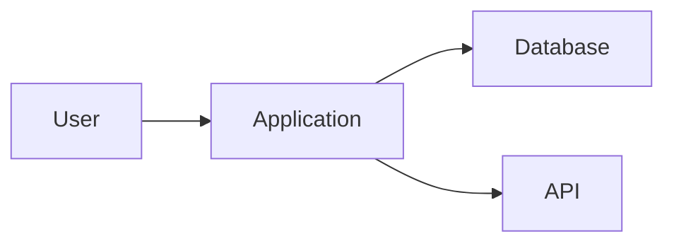

# Documentation Style Guide

## Document Information
- **Organization:** [Organization Name]
- **Last Updated:** [Date]
- **Maintained By:** [Documentation Team/Technical Writing Team]
- **Version:** [Style Guide Version]
- **Scope:** [Products/Services covered by this guide]

---

## Table of Contents

1. [Purpose and Scope](#purpose-and-scope)
2. [Voice and Tone](#voice-and-tone)
3. [Grammar and Mechanics](#grammar-and-mechanics)
4. [Formatting and Structure](#formatting-and-structure)
5. [Word Choice and Terminology](#word-choice-and-terminology)
6. [Writing for Different Content Types](#writing-for-different-content-types)
7. [Accessibility](#accessibility)
8. [Markdown Guidelines](#markdown-guidelines)
9. [Code and Technical Content](#code-and-technical-content)
10. [Screenshots and Images](#screenshots-and-images)
11. [Review and Publishing](#review-and-publishing)

---

## Purpose and Scope

### Purpose of This Guide

This style guide ensures consistency, clarity, and quality across all [Organization Name] documentation.

**Use this guide when creating:**
- User documentation
- API documentation
- Technical guides
- Tutorials
- FAQs
- Help center articles
- Release notes
- Internal documentation
- README files

**Goals:**
- **Consistency:** All documentation looks and feels cohesive
- **Clarity:** Users find answers quickly
- **Usability:** Content is scannable and actionable
- **Accessibility:** Documentation is usable by everyone
- **Maintainability:** Easy to update and keep current

---

### How to Use This Guide

**For writers:**
1. Read this guide in full before writing
2. Reference specific sections as needed
3. Follow guidelines closely
4. Ask questions if unsure (contact: [docs@example.com])

**For reviewers:**
1. Use this guide as checklist during reviews
2. Point writers to specific sections for corrections
3. Suggest updates to this guide if gaps found

**For developers:**
1. Follow guidelines when writing code comments
2. Use for README files and inline documentation
3. Reference when contributing to docs

**Updates to this guide:**
- Quarterly review by documentation team
- Submit suggestions: [link to feedback form]
- Track changes in [Version History](#version-history)

---

## Voice and Tone

### Voice

Our voice is the consistent personality in all documentation.

**Our voice is:**
- **Clear and direct:** Say what you mean simply
- **Helpful and supportive:** Guide users to success
- **Professional but friendly:** Expert yet approachable
- **Confident but humble:** Know our stuff, admit when we don't
- **Respectful:** Value the user's time and intelligence

**Our voice is NOT:**
- Overly casual or chatty
- Condescending or patronizing
- Corporate jargon-filled
- Overly technical for the audience
- Apologetic or uncertain

---

### Tone

Tone adjusts based on context while maintaining our voice.

**General guidelines:**

| Content Type | Tone | Example |
|--------------|------|---------|
| **Error messages** | Clear, helpful, not blame-focused | ❌ "You entered an invalid email"<br>✅ "Email address should include @" |
| **Tutorials** | Encouraging, instructive | "Great! You've created your first project." |
| **API docs** | Professional, precise, technical | "Returns a 204 No Content status on success" |
| **FAQs** | Conversational, straightforward | "Yes! You can export your data anytime." |
| **Warnings** | Serious, clear, action-focused | "⚠️ This action cannot be undone. All data will be permanently deleted." |
| **Success messages** | Positive, brief | "✅ Settings saved successfully" |

**Adjust tone for:**
- **Good news:** More enthusiastic ("Exciting news! We've launched...")
- **Bad news:** More empathetic, solution-focused ("We're sorry for the inconvenience. Here's how to fix it...")
- **Complex topics:** Patient, step-by-step ("Let's break this down...")
- **Urgent issues:** Direct, actionable ("Update immediately to fix security vulnerability")

---

### Person and Point of View

**Use second person** ("you") to address users directly:
- ✅ "You can create a project by clicking..."
- ❌ "Users can create a project..."
- ❌ "One can create a project..."

**Avoid first person plural** ("we") except when speaking as the company:
- ✅ "We've released a new feature..."
- ❌ "We can create a project by..."

**Exception:** Tutorials may use "we" for collaborative tone:
- ✅ "In this tutorial, we'll build a dashboard..."

**Use active voice:**
- ✅ "Click the Save button"
- ❌ "The Save button should be clicked"

**Exceptions for passive voice:**
- Error messages: "Your session has expired" (focus on state, not who caused it)
- When the actor is unknown or unimportant: "Data is encrypted at rest"

---

## Grammar and Mechanics

### Capitalization

**Sentence case for headings** (not title case):
- ✅ "How to create a project"
- ❌ "How To Create A Project"
- ❌ "How to Create a Project"

**Capitalize:**
- Proper nouns: "GitHub," "Slack," "Google Calendar"
- Product names: "[Product Name]" (exactly as trademarked)
- UI elements exactly as shown: "Save" button, "Projects" tab
- First word after colon in headings: "Error: File not found"

**Don't capitalize:**
- "internet," "website," "email," "online"
- Job titles: "product manager," "software engineer"
- Generic terms: "the homepage," "the dashboard"

---

### Punctuation

**Periods:**
- ✅ End sentences with periods
- ✅ Use in abbreviations: "e.g.," "i.e.," "etc."
- ❌ Don't use in headings or UI labels
- ❌ Don't use in single items in lists (unless complete sentences)

**Commas:**
- ✅ Oxford comma (serial comma): "projects, tasks, and files"
- ✅ After introductory phrases: "After logging in, click Projects"
- ✅ Around parenthetical phrases: "The API, which is RESTful, returns JSON"

**Colons:**
- ✅ Introduce lists: "Three options: create, edit, delete"
- ✅ After "Example:" or "Note:"
- ❌ Don't use after "such as," "including," "like"

**Semicolons:**
- Avoid when possible; use periods or lists instead
- OK for joining closely related independent clauses

**Exclamation points:**
- Use sparingly! Only for genuine excitement
- ✅ "Congratulations! You've completed the tutorial"
- ❌ "Click Save!" (not exciting)
- Max 1-2 per page

**Quotation marks:**
- Use for exact quotes: The error says "File not found"
- Not for emphasis (use bold or italics)
- Not for UI elements (use code format)

**Apostrophes:**
- Contractions: "don't," "you'll," "we're" (acceptable in docs)
- Possessives: "user's settings," "API's response"

**Hyphens and dashes:**
- **Hyphen (-)**: Compound words: "user-friendly," "step-by-step"
- **En dash (–)**: Ranges: "pages 10–20," "2020–2025"
- **Em dash (—)**: Emphasis or interruption—use sparingly

---

### Abbreviations and Acronyms

**First use:**
- Spell out fully, then abbreviation in parentheses
- "Single Sign-On (SSO)"
- "Application Programming Interface (API)"

**Subsequent uses:**
- Use abbreviation only: "SSO is available on Enterprise plan"

**Exceptions** (don't spell out):
- Well-known: HTML, CSS, URL, PDF, FAQ, USB
- When the abbreviation is better known: FAQ (not "frequently asked questions")

**Periods:**
- Modern style: No periods
  - ✅ FAQ, API, HTML, USA
  - ❌ F.A.Q., A.P.I.

**Plurals:**
- Add lowercase 's': APIs, FAQs, PDFs
- No apostrophe: ❌ API's, FAQ's

---

### Numbers

**Spell out:**
- One through nine: "five users," "three steps"
- Numbers that start sentences: "Ten projects are included"

**Use numerals:**
- 10 and above: "10 users," "50 projects"
- All numbers in tables, lists, and technical contexts
- Percentages: "5%" not "five percent"
- Measurements: "5 GB," "10 minutes," "3 days"
- Versions: "version 2," "iOS 14"
- Currency: "$10," not "ten dollars"

**Exceptions:**
- "24/7" not "twenty-four seven"
- "one-time" (hyphenated adjective)

**Commas in large numbers:**
- ✅ "1,000 users," "1,000,000 requests"
- ❌ "1000 users"

**Ranges:**
- Use en dash: "10–20 minutes," "pages 5–10"
- In tables/UI: hyphen is OK: "10-20 min"

---

### Lists

**Use lists to improve scannability.**

**When to use:**
- 3+ related items
- Steps in a process
- Options or choices
- Requirements or prerequisites

**Types:**

**Numbered lists (ordered):**
- Use for sequential steps or ranked items
- Start each item with capital letter
- End with period if complete sentences
- No period if fragments

```markdown
1. Open the application
2. Click Settings
3. Select your preferences
4. Click Save
```

**Bulleted lists (unordered):**
- Use for non-sequential items
- Parallel structure (all verbs, all nouns, etc.)
- Introduce with colon or complete sentence

```markdown
Features include:
- Project management
- Team collaboration
- File sharing
- Real-time updates
```

**Nested lists:**
- Use sparingly (max 2 levels)
- Indent sub-items

---

## Formatting and Structure

### Headings

**Hierarchy:**
- H1: Page title (one per page)
- H2: Main sections
- H3: Subsections
- H4: Sub-subsections (use sparingly)
- Don't skip levels (H1 → H3)

**Style:**
- Sentence case
- No periods
- Descriptive and specific
- Front-load with keywords

**Examples:**
- ✅ "How to create a project"
- ✅ "API authentication"
- ❌ "Creation" (too vague)
- ❌ "Getting started with creating projects" (too long)

**Make headings scannable:**
- Users skim headings
- Each heading should make sense out of context
- Include action words: "Configure," "Install," "Troubleshoot"

---

### Paragraphs

**Keep paragraphs short:**
- 2-4 sentences ideal
- Max 6-7 lines on screen
- One idea per paragraph

**Structure:**
- Topic sentence first (main point)
- Supporting details follow
- Transition to next paragraph

**Examples:**

❌ **Too long and dense:**
```
The API uses OAuth 2.0 for authentication which is an industry-standard
protocol for authorization and it provides a secure way for third-party
applications to access user data without exposing passwords and it supports
multiple grant types including authorization code, implicit, resource owner
password credentials, and client credentials and each has its own use case
and security considerations.
```

✅ **Better:**
```
The API uses OAuth 2.0 for authentication, an industry-standard protocol.

OAuth 2.0 provides secure third-party access without exposing passwords.
It supports four grant types:
- Authorization code
- Implicit
- Resource owner password credentials
- Client credentials

Each grant type has specific use cases and security considerations.
```

---

### Emphasis

**Bold:**
- UI elements: Click **Save**
- Important terms on first use: **Two-factor authentication (2FA)**
- Warnings: **Warning:** This action cannot be undone
- Navigation: Go to **Settings** > **Security**

**Italics:**
- Emphasis: "This is *not* recommended"
- Variables in code: `GET /users/{*userId*}`
- Book/publication titles: *REST API Design Rulebook*

**Code formatting** (monospace):
- Code: `const API_KEY = "abc123"`
- Commands: `npm install`
- File names: `config.json`
- URLs: `https://api.example.com`
- API endpoints: `POST /v2/projects`
- Keyboard keys: Press `Ctrl+S`

**Don't use:**
- Underline (confusing with links)
- ALL CAPS (looks like shouting)
- Excessive exclamation points

---

### Links

**Link text should be descriptive:**
- ✅ "See the [API documentation](link) for details"
- ✅ "Learn more about [authentication methods](link)"
- ❌ "Click [here](link) for more info"
- ❌ "For more information, see [this page](link)"

**Internal links:**
- Use relative paths: `[Guide](../guides/setup.md)`
- Link to specific headings: `[Installation](#installation)`

**External links:**
- Open in new tab (user preference in some systems)
- Indicate external: "GitHub (opens in new tab)" or use icon

**URL display:**
- Shorten long URLs: [example.com](https://example.com/very/long/path) not https://example.com/very/long/path
- Exception: If URL is the content: `https://api.example.com/v2/users`

---

### Tables

**Use tables for structured data:**
- Comparison of options
- Reference information
- Lists with multiple attributes

**Table guidelines:**
- Header row: Bold, describes column content
- Left-align text columns
- Right-align number columns
- Keep cells concise (not full paragraphs)
- Use "—" for N/A or empty cells

**Example:**

| Feature | Free | Pro | Enterprise |
|---------|------|-----|------------|
| **Users** | Up to 5 | Unlimited | Unlimited |
| **Storage** | 100 MB | 1 GB | Unlimited |
| **Support** | Email | Priority | Phone |
| **SSO** | — | — | ✅ |

---

### Callouts and Admonitions

**Use callouts to highlight important information.**

**Types:**

**Note** (ℹ️ or 📝):
- Additional information
- Related tips
- "Note: This feature requires Pro plan"

**Tip** (💡):
- Helpful suggestions
- Best practices
- "Tip: Use keyboard shortcuts to work faster"

**Warning** (⚠️):
- Potential problems
- Important caveats
- "Warning: This action cannot be undone"

**Danger/Caution** (🚨 or ❌):
- Data loss
- Security issues
- "Caution: Deleting your account permanently removes all data"

**Format:**
```markdown
**💡 Tip:** Use the keyboard shortcut `Ctrl+S` to save quickly.

**⚠️ Warning:** This action cannot be undone.
```

**Don't overuse:**
- Max 2-3 per page
- If everything is a warning, nothing stands out

---

## Word Choice and Terminology

### Preferred Terms

**Use simple, common words:**

| Instead of | Use |
|------------|-----|
| utilize | use |
| commence | start, begin |
| terminate | end, stop |
| prior to | before |
| subsequent to | after |
| in order to | to |
| at this point in time | now |
| leverage | use |

---

### Product-Specific Terms

**Standardize terminology:**

| Correct Term | Don't Use | Notes |
|--------------|-----------|-------|
| [Product Name] | [product], the app, the tool | Exact product name |
| project | Project (uncapitalized) | Generic term |
| task | to-do, item, ticket | Standardize on "task" |
| workspace | account, organization | Use "workspace" consistently |
| file attachment | attachment, upload, file | "File attachment" is clearest |

**Create a terminology database:**
- Maintain list of approved terms
- Update when new features launch
- Share with all writers

---

### Inclusive Language

**Write for diverse audiences:**

**Gender:**
- Use "they/them" for singular: "When a user logs in, they see..."
- Not "he/she," "s/he," "he or she"
- Use role instead of gendered term: "sales representative" not "salesman"

**Ability:**
- "Person with disability" not "disabled person" (person-first language)
- "Accessible" not "handicapped accessible"
- Don't use disability as metaphor: Not "tone-deaf," "blind spot," "cripple"

**Age:**
- Avoid age-related terms: "digital native," "tech-savvy millennials"

**Other:**
- Avoid idioms that don't translate: "hit a home run," "low-hanging fruit"
- Be culturally neutral: "holiday" not "Christmas" (unless specific)

---

### Technical Terms

**Define technical terms on first use:**
- "Application Programming Interface (API)"
- "Single Sign-On (SSO)"

**Use glossary for:**
- Frequently used terms
- Industry jargon
- Product-specific concepts

**Don't oversimplify:**
- ✅ "algorithm" (don't say "computer recipe")
- ✅ "database" (don't say "place where data lives")
- Audience determines technical level

---

## Writing for Different Content Types

### Tutorials

**Structure:**
1. **Introduction:**
   - What they'll learn
   - Prerequisites
   - Estimated time
2. **Step-by-step instructions:**
   - Numbered steps
   - One action per step
   - Screenshots for complex steps
3. **Verification:**
   - How to confirm it worked
4. **Next steps:**
   - Related tutorials
   - Further reading

**Style:**
- Encouraging tone
- Second person: "You'll create..."
- Present tense for steps: "Click Save" not "You will click Save"
- Acknowledge completion: "Great! You've completed..."

**Example:**
```markdown
## Create Your First Project

**Time:** 5 minutes
**Prerequisites:** Active account

### Step 1: Navigate to Projects

1. Log in to your account
2. Click **Projects** in the main navigation
3. Click **+ New Project**

You should see the project creation form.

### Step 2: Fill in Details

1. Enter a project name: "My First Project"
2. Add description (optional)
3. Click **Create**

**✅ Success!** You've created your first project.
```

---

### How-To Guides

**Focused on specific tasks:**
- "How to export data"
- "How to reset your password"
- "How to configure SSO"

**Structure:**
1. Brief intro (what and why)
2. Prerequisites (if any)
3. Steps (numbered)
4. Verification or result

**Style:**
- Imperative mood: "Click," "Enter," "Select"
- Concise and direct
- Assume user knows basics

---

### Reference Documentation

**Comprehensive, detailed, organized:**
- API reference
- Configuration options
- Command reference

**Structure:**
- Alphabetical or logical grouping
- Consistent format for each entry
- Include all parameters, options, examples

**Style:**
- Precise and technical
- Complete, not conversational
- Tables for structured info

**Example (API endpoint):**
```markdown
## GET /v2/users/{userId}

Retrieve details for a specific user.

**Authentication:** Required

**Parameters:**
| Name | Type | Required | Description |
|------|------|----------|-------------|
| `userId` | string | Yes | Unique user identifier |

**Response:** 200 OK
```json
{
  "id": "user_123",
  "name": "John Doe",
  "email": "john@example.com"
}
```

**Errors:**
- `404 Not Found` - User doesn't exist
```

---

### Troubleshooting

**Problem-solution format:**

**Structure:**
1. Symptom/problem description
2. Possible causes
3. Solutions (ordered by likelihood)
4. How to verify fix

**Style:**
- Empathetic: "If you're experiencing..."
- Action-oriented: Solutions start with verbs
- Clear success criteria

**Example:**
```markdown
### Issue: Can't Log In

**Symptoms:**
- Login fails with "Incorrect password"
- Account locked message

**Possible Causes:**
- Incorrect password
- Caps Lock enabled
- Account locked after failed attempts

**Solutions:**

1. **Check Caps Lock:** Ensure Caps Lock is off
2. **Reset password:**
   - Click "Forgot Password"
   - Check email for reset link
   - Create new password
3. **Wait for auto-unlock:** Accounts unlock after 30 minutes

**Verify:** Try logging in with new password
```

---

### Release Notes

**Inform users of changes:**

**Structure:**
- Version number and date
- Sections: Added, Changed, Fixed, Deprecated, Removed, Security
- Brief descriptions

**Style:**
- Past tense: "Added," "Fixed"
- User-focused: Impact not implementation
- Link to docs for details

**Example:**
```markdown
## Version 2.1.0 — February 10, 2026

### Added
- **Dark mode** - Toggle in Settings > Appearance
- **Bulk task editing** - Select multiple tasks and edit at once

### Fixed
- Issue where notifications weren't sent for @mentions
- Slow performance when loading large projects

### Changed
- Improved search algorithm for faster results
- Updated UI for project settings page

See [full changelog](link) for technical details.
```

---

## Accessibility

### Write for All Users

**Guidelines:**

**1. Structure:**
- Use semantic headings (H1, H2, H3)
- Screen readers navigate by headings
- Don't skip heading levels

**2. Links:**
- Descriptive link text
- ❌ "Click here"
- ✅ "Download the user guide"

**3. Images:**
- Always include alt text
- Describe content/function
- "Dashboard showing three projects" not "image1.png"

**4. Color:**
- Don't rely on color alone: "Click the red button" → "Click the Delete button"
- Ensure color contrast (WCAG AA minimum)

**5. Tables:**
- Use header row
- Keep simple structure
- Provide caption or summary

**6. Language:**
- Plain language (8th-grade reading level)
- Short sentences
- Active voice
- Define acronyms

**7. Multimedia:**
- Provide transcripts for audio
- Captions for video
- Text alternative for diagrams

---

### Testing for Accessibility

**Tools:**
- Screen reader testing (NVDA, JAWS, VoiceOver)
- Color contrast checker
- Hemingway Editor (readability)
- WAVE (web accessibility evaluation)

**Manual checks:**
- Can you navigate with keyboard only?
- Does content make sense when read aloud?
- Can you understand without images?

---

## Markdown Guidelines

### Basic Syntax

**Headings:**
```markdown
# H1 Heading
## H2 Heading
### H3 Heading
```

**Emphasis:**
```markdown
**bold text**
*italic text*
`code or command`
```

**Lists:**
```markdown
1. Ordered item
2. Another item

- Unordered item
- Another item
```

**Links:**
```markdown
[Link text](https://example.com)
[Internal link](#heading-id)
```

**Code blocks:**
````markdown
```javascript
const example = "code";
```
````

**Images:**
```markdown

```

---

### Extended Syntax

**Tables:**
```markdown
| Column 1 | Column 2 |
|----------|----------|
| Data     | Data     |
```

**Blockquotes:**
```markdown
> This is a quote
```

**Horizontal rule:**
```markdown
---
```

**Task lists:**
```markdown
- [x] Completed task
- [ ] Incomplete task
```

---

### Best Practices

**Consistency:**
- Use same markers throughout: `*` or `-` for bullets (not mixed)
- Consistent heading style

**Blank lines:**
- Add blank line before/after headings
- Add blank line before/after lists
- Add blank line before/after code blocks

**Line length:**
- Wrap at 80-100 characters (for readability in editors)
- Except code blocks and URLs

---

## Code and Technical Content

### Code Snippets

**Inline code:** Use backticks for short snippets
- File names: `config.json`
- Commands: `npm install`
- Functions: `getUserData()`
- Variables: `apiKey`

**Code blocks:** Use for multi-line code
````markdown
```javascript
function greet(name) {
  return `Hello, ${name}!`;
}
```
````

**Include:**
- Language identifier for syntax highlighting
- Comments for complex code
- Context before code block

**Example:**
```markdown
To configure the API key, update your `.env` file:

```bash
API_KEY=your_key_here
API_URL=https://api.example.com
```

Then restart your application.
```

---

### Command Line

**Format:**
- Show commands exactly as typed
- Include `$` prompt for clarity (or `>` for Windows)
- Show expected output

**Example:**
```markdown
Run the installation command:

```bash
$ npm install example-package
```

Expected output:
```
+ example-package@1.2.3
added 1 package in 2s
```
```

---

### API Documentation

**Endpoint format:**
```markdown
## POST /v2/projects

Create a new project.

**Authentication:** Required
**Scope:** `write:projects`

**Request Body:**
```json
{
  "name": "Project Name",
  "description": "Optional description"
}
```

**Response:** 201 Created
```json
{
  "id": "proj_123",
  "name": "Project Name",
  "created_at": "2026-02-10T15:00:00Z"
}
```

**Errors:**
- `400 Bad Request` - Invalid parameters
- `401 Unauthorized` - Missing authentication
```

---

### File Paths and Names

**Format:**
- Use code formatting: `config.json`
- Show full path when relevant: `/etc/config/settings.json`
- Use forward slashes `/` (even for Windows when possible)
- Show placeholders in italics: `/users/*{userId}*/settings`

---

## Screenshots and Images

### When to Use Screenshots

**Use screenshots for:**
- Complex UI interactions
- Visual verification ("You should see...")
- UI that's hard to describe
- Dashboard/report examples

**Don't screenshot:**
- Simple buttons or links (describe instead)
- Text that could be copied (use code block)
- Constantly changing UI

---

### Screenshot Guidelines

**Quality:**
- High resolution (2x for retina)
- PNG format (lossless)
- Crop tightly to relevant area
- Remove sensitive data (blur or redact)

**Annotations:**
- Number steps (1, 2, 3)
- Arrows for emphasis
- Red boxes/circles for highlighting
- Keep minimal (don't clutter)

**Consistency:**
- Same theme/appearance in all screenshots
- Same zoom level
- Same browser (if web app)

**Alt text:**
- Describe what's shown: "Dashboard displaying three projects with completion status"
- Don't say "screenshot of..." (redundant)

---

### Diagrams

**Use diagrams for:**
- Architecture
- Workflows
- Data flow
- Relationships

**Tools:**
- Mermaid (text-based diagrams in Markdown)
- Lucidchart, Draw.io, Figma

**Example (Mermaid):**
```markdown

```

---

## Review and Publishing

### Review Process

**Before publishing, ensure:**

**Content review:**
- [ ] Accurate and up-to-date
- [ ] Complete (no TODOs or placeholders)
- [ ] Follows style guide
- [ ] Links work
- [ ] Code examples tested

**Copy editing:**
- [ ] Grammar and spelling
- [ ] Consistent terminology
- [ ] Proper capitalization
- [ ] No typos

**Technical review:**
- [ ] Technically accurate
- [ ] Code examples work
- [ ] Commands tested
- [ ] Screenshots current

**Accessibility:**
- [ ] Alt text for images
- [ ] Heading hierarchy
- [ ] Link text descriptive
- [ ] Color contrast sufficient

---

### Publishing Checklist

**Before publishing:**
1. [ ] Metadata complete (title, description, date)
2. [ ] Categories/tags assigned
3. [ ] Table of contents generated (if long)
4. [ ] Cross-references updated
5. [ ] Tested in production environment
6. [ ] Reviewed by subject matter expert
7. [ ] Approved by documentation lead

**After publishing:**
1. [ ] Verify live version renders correctly
2. [ ] Test all links
3. [ ] Add to documentation index
4. [ ] Announce to team (if major update)
5. [ ] Monitor for feedback

---

### Version Control

**Track changes:**
- Use Git for version control
- Meaningful commit messages: "Add troubleshooting section for login issues"
- Feature branches for major updates
- Tag releases: `v2.1.0`

**Document changes:**
- Maintain changelog
- Version number in document metadata
- Last updated date

---

### Maintenance

**Review schedule:**
- Quarterly: Review all docs for accuracy
- With product releases: Update affected docs
- When bugs reported: Fix immediately

**Deprecation:**
- Mark outdated docs clearly
- Link to current version
- Keep old docs for reference (don't delete)

**Example:**
```markdown
⚠️ **This document is outdated.**
See the [updated guide](link) for current information.
```

---

## Additional Resources

### Tools

**Writing:**
- Hemingway Editor - Readability
- Grammarly - Grammar and spelling
- VSCode - Markdown editing

**Screenshots:**
- Snagit - Capture and annotate
- CloudApp - Quick captures
- macOS Screenshot - Built-in tool

**Diagrams:**
- Mermaid - Text-based diagrams
- Lucidchart - Flowcharts and diagrams
- Draw.io - Free diagramming

**Accessibility:**
- WAVE - Web accessibility
- Color contrast checker
- Screen readers (NVDA, JAWS, VoiceOver)

---

### Reference Materials

**Style guides (external):**
- [Google Developer Documentation Style Guide](https://developers.google.com/style)
- [Microsoft Writing Style Guide](https://docs.microsoft.com/style-guide)
- [Chicago Manual of Style](https://www.chicagomanualofstyle.org)

**Accessibility:**
- [WCAG Guidelines](https://www.w3.org/WAI/WCAG21/quickref/)
- [WebAIM](https://webaim.org)

**Writing:**
- [Plain Language Guidelines](https://plainlanguage.gov)
- [Purdue OWL](https://owl.purdue.edu)

---

## Version History

| Version | Date | Changes | Author |
|---------|------|---------|--------|
| 1.0 | 2026-02-10 | Initial release | Documentation Team |

---

## Feedback

**Improve this style guide:**
- Submit suggestions: [docs@example.com]
- GitHub: [link to repo]
- Slack: #documentation

**Questions?**
Contact: [docs@example.com]

---

**© 2026 [Organization Name]. All rights reserved.**
