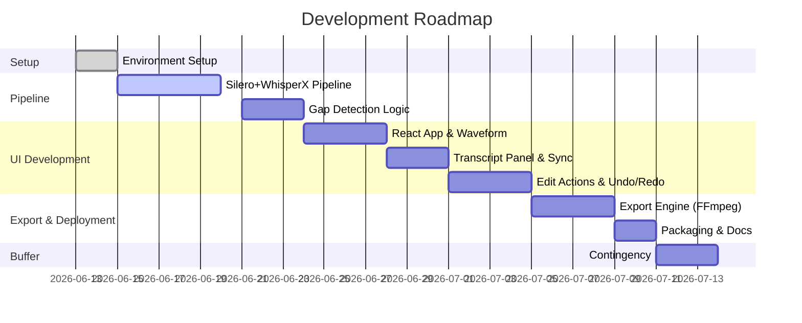

# Executive Summary  
We evaluate three existing open-source projects — **Silero VAD**, **WhisperX**, and **Auto-Editor** — to reuse their capabilities in a new AI-powered video editor. Each repo’s purpose, core modules, APIs, outputs, licensing, strengths/limitations, and integration points are analyzed. Additional components for the **UI and export pipeline** are recommended (WaveSurfer.js, Remotion, LosslessCut, FFmpeg, etc.), with comparative tables. We then design adapter interfaces and a data model/JSON schema for the editing project (including speech segments, transcript lines, candidate cuts, user decisions, EDL/SRT/VTT mapping). A processing pipeline is outlined with expected performance (CPU/GPU, memory) and fallbacks (auto-editor loudness-based). UI/UX mockups and interactions (timeline, right-click revert, keep/cut toggles) are sketched. Security, licensing, and deployment (desktop app/Electron vs container) are covered. Finally, a prioritized roadmap with milestones (person-days) and acceptance criteria is given, along with code examples using Silero VAD, WhisperX, Auto-Editor, and FFmpeg for key tasks (speech timestamps, transcript, SRT, cutting). All information is cited from official documentation and repos.

## 1. Core Components Analysis

### Silero VAD (snakers4/silero-vad)  
- **Purpose:** High-accuracy *Voice Activity Detection* (VAD) to locate human speech in audio.  
- **Core Modules:** Python library (PyTorch/onnx). Key functions: `load_silero_vad()`, `read_audio()`, `get_speech_timestamps()`. No GUI; purely backend.  
- **Language/Runtime:** Python 3.8+, PyTorch ≥1.12 (or ONNX). Can use torch.hub interface or pip package (MIT licensed).  
- **Install/Run:** `pip install silero-vad` or via `torch.hub.load('snakers4/silero-vad', model='silero_vad')`. Use `read_audio(path)` then `get_speech_timestamps(wav, model, return_seconds=True)` to get speech segments in seconds.  
- **API/Outputs:** Returns list of `{start, end}` speech intervals in seconds or samples. Internally uses audio I/O (torchaudio/ffmpeg) and returns word-aligned VAD.  
- **Strengths:** Extremely fast (≈0.001s per 30ms frame on CPU), high accuracy across 6000+ languages, tiny model (~2MB), permissive MIT license. Well-maintained (frequent commits, current to 2024) with active community.  
- **Limitations:** Requires ML runtime (PyTorch/ONNX); CPU mode is fast but GPU can speed it further. No built-in UI or CLI, so needs to be wrapped or called via Python.  
- **Integration Points:** We should use it as a Python *vendor library* (import in backend). Key call:  
  ```python
  from silero_vad import load_silero_vad, read_audio, get_speech_timestamps
  model = load_silero_vad()
  wav = read_audio('audio.wav')
  segments = get_speech_timestamps(wav, model, return_seconds=True)
  ```  
  Alternatively, use `torch.hub.load('snakers4/silero-vad')` to import as shown. The output `segments` (list of `{start,end}`) becomes our “speech segments” source.  

### WhisperX (m-bain/whisperX)  
- **Purpose:** *Accurate ASR* with **word-level timestamps** and optional speaker diarization. Builds on OpenAI’s Whisper with forced alignment for precise timing.  
- **Core Modules:** Python package. Integrates Whisper (via `faster-whisper` for speed) and wav2vec2 for alignment, plus `pyannote-audio` for diarization if enabled.  
- **Language/Runtime:** Python, requires PyTorch, ffmpeg, Rust (for whisper), HuggingFace API (if diarization). Installation via `pip install whisperx`. Free BSD-2 license.  
- **Install/Run:** `pip install whisperx` or clone the repo. Usage:  
  ```bash
  whisperx path/to/audio.wav --model large-v2 --diarize --device cpu
  ```  
  The CLI produces output in multiple formats (txt transcript, SRT/VTT subtitles, JSON alignments). Output: transcript segments with `{start, end, text}` per sentence, plus word-level times.  
- **API/Outputs:** WhisperX outputs aligned transcriptions. By default it prints and saves a transcript text and an SRT file with precise timings. The readme shows an example waveform vs inaccurate transcript. CLI flags include `--highlight_words True` to annotate word timings.  
- **Strengths:** Very accurate timestamps (70× realtime with GPU), built-in alignment and diarization. Actively developed (conference paper, 1st place in transcription challenge). Output includes convenient SRT/VTT/JSON.  
- **Limitations:** Heavy dependencies (CUDA for best performance). Without GPU, large models may be slow (though `faster-whisper` helps). Requires ∼<8GB GPU for large-v2. If GPU is unavailable, must use CPU mode (`--device cpu`), which will be slower.  
- **Integration Points:** Use as Python library or CLI. Example library usage:  
  ```python
  from whisperx import load_model, align_model
  model = load_model('large-v2', device='cpu')
  result = model.transcribe('audio.wav')
  # result.segments contains transcript with word-level times
  ```  
  Or via CLI:  
  ```bash
  whisperx audio.wav --model large-v2 --language en --output_dir out/
  ```  
  We will likely wrap the CLI in a backend service or call functions to generate transcripts and get word timestamps for aligning with video. Use its JSON output to merge with speech segments.  

### Auto-Editor (WyattBlue/auto-editor)  
- **Purpose:** CLI tool for automatic video/audio editing (primarily loudness/motion-based). Often used to cut silences by audio volume thresholds.  
- **Core Modules:** Nim-based executable (no Python API). Supported edits: audio loudness, motion, scene change, subtitles, etc.  
- **Language/Runtime:** Nim. Distributed as compiled binary or pip package (`pip install auto-editor` provides a CLI). License: [Unlicense/public domain]. 4.4k stars, very active (latest commit Jun 2026).  
- **Install/Run:**  
  ```bash
  pip install auto-editor  # or download binary
  auto-editor path/to/video.mp4 [options]
  ```  
  Default operation: cuts out “dead space” (silence/low audio by threshold). Key CLI flags: `--edit audio`, `--margin` for padding, `--when-silent cut` vs `--when-normal nil` to invert cuts, `--export` for timelines (Premiere/Resolve/etc).  
- **Outputs:** By default produces a trimmed video (named `*_ALTERED.mp4`). Can export EDL/XML for editors. Supports naming segments for external tools. Can output the cut “timeline” as well, and even accept EDL as input.  
- **Strengths:** Mature (since 2017), wide feature set, very fast (Nim). Highly configurable via CLI, many export formats. No forced GUI. It cuts by loudness well if no noise.  
- **Limitations:** Based on volume/motion, **not speech**. Hence background music will confuse it. We will *not* rely on it for final cuts, but it can serve as a *baseline or fallback*.  
- **Integration Points:** Use via subprocess from Python. For example:  
  ```python
  import subprocess
  cmd = ["auto-editor", "input.mp4", "--trim", "--when-silent", "cut", "--when-normal", "nil", "--export", "json"]
  subprocess.run(cmd, check=True)
  ```  
  The `--export json` yields a JSON EDL of segments. We would parse this only if needed (e.g. as a fallback if VAD pipeline fails).  We primarily use our custom logic (Silero+WhisperX) instead.  

### Summary Table of Core Repos

| Project      | Purpose                    | Language  | License       | Key Output                    | Stars/Activity | Integration Use                |
|--------------|----------------------------|-----------|---------------|-------------------------------|----------------|-------------------------------|
| **Silero VAD**   | Speech activity detection | Python (torch) | MIT           | List of `{start,end}` (s) for speech | 540★, active | Import as Python lib; call `get_speech_timestamps` |
| **WhisperX**     | ASR & diarization with word timestamps | Python       | BSD-2-Clause | Transcript (text/SRT/VTT/JSON with word times) | 1.7k★, active | Use library or CLI; get timed transcript segments |
| **Auto-Editor**  | Automated cuts (audio/motion) | Nim         | Unlicense (PD) | Trimmed video; EDL/JSON timelines | 4.4k★, active | CLI subprocess fallback; parse JSON EDL if needed |

## 2. Additional OSS Components (UI & Pipeline)

We recommend these open-source components to handle waveform display, timeline UI, and export logic:

- **WaveSurfer.js**: MIT-licensed JS library for interactive audio waveforms. Highly customizable, supports regions and timeline plugins. [katspaugh/wavesurfer.js](https://github.com/katspaugh/wavesurfer.js) (★10k) is mature and perfect for showing waveforms in a React UI. Integrates with HTML5 audio/video elements.  
- **Remotion**: MIT-licensed React-based video rendering framework. Allows building custom video compositions with React components. Good for generating final video programmatically or previews (though primarily an output tool, not required if we use FFmpeg for final render). Might be used to automate short clips creation or previews.  
- **LosslessCut (mifi/lossless-cut)**: GPL2-licensed Electron/React app for manual lossless trimming. Not to be embedded in our app, but its **UI and workflow** are ideal references. It shows waveform, timeline, segments, keyboard shortcuts, undo/redo, and subtitle viewing. We embed its screenshot below to illustrate the desired UX.  

 *Figure: **LosslessCut** showing video preview, waveform timeline, and segmented clips (design inspiration). Provides clear visual cues for segments and cuts.*  

- **FFmpeg / FFmpeg Wrappers**: Foundational tool for audio/video processing. We'll use FFmpeg for low-level tasks: audio extraction, trimming (lossless re-muxing), final encoding. Libraries like [FFmpeg-python](https://github.com/kkroening/ffmpeg-python) (MIT) or direct `subprocess` calls will be used.  
- **React Timeline/Swimlane UI**: Generic libraries for draggable timeline blocks can be used, e.g. [nuka-carousel](https://github.com/FormidableLabs/nuka-carousel) (not specifically timeline), or simply custom divs with drag/drop. (LosslessCut UI and Wavesurfer regions plugin will cover most needs.)  
- **SRT/VTT generation**: We rely on WhisperX for generating SRT. For editing/transcript, a React component for subtitles (like [video-react](https://github.com/video-react/video-react)) might be used for display.  

### Comparative Table: Candidate Components

| Component        | Purpose            | Language     | License        | Integration Effort | Maturity | UI Quality | Notes |
|------------------|--------------------|--------------|----------------|--------------------|----------|------------|-------|
| **Wavesurfer.js**    | Waveform + audio regions | JS           | BSD-3-Clause   | Easy (npm package)  | 10k★   | ★★★★☆  | Highly customizable; supports timeline plugin. |
| **LosslessCut UI**   | Timeline & cuts UI | JS (Electron) | GPL-2.0        | Hard (cannot embed code) | 40k★   | ★★★★★  | Use as inspiration; can import concepts. |
| **Remotion**         | Video rendering    | JS/React      | MIT            | Medium             | 5k★    | ★★★☆☆  | Great for scripted videos; may not needed if using FFmpeg. |
| **React Draggable**  | Draggable UI blocks | JS           | MIT            | Easy              | -      | ★★★★☆  | For timeline block resizing (e.g. [react-draggable]). |
| **FFmpeg (py)**      | Video processing  | C / Python binding | LGPL/GPL  | Low-level calls    | -      | n/a      | Essential for cuts/encodes. |
| **ffmpeg-python**    | FFmpeg wrapper    | Python        | MIT            | Moderate          | 8k★    | n/a      | Python bindings for fluent FFmpeg commands. |

## 3. Adapter Design

We propose **adapter layers** to decouple our app from the exact dependencies:

- **Silero VAD Adapter:** Python module (`silero_vad_adapter`) with function `get_speech_segments(video_path)`. Implementation: extract audio (via FFmpeg), call Silero's API to get speech timestamps, return list of segments. Input: video file path. Output JSON:  
  ```jsonc
  { "speech_segments": [
       {"start":0.5, "end":4.8},
       {"start":8.0, "end":13.2},
       ...
    ]
  }
  ```  
  (Wrap exceptions like file-not-found, format errors; performance: ~<1s per minute of audio on CPU.) Use as Python import.

- **WhisperX Adapter:** Python module (`whisperx_adapter`) with function `get_transcript(audio_path)`. Implementation: call WhisperX transcribe (either as library or subprocess CLI). Output: transcript segments and word timestamps. Example JSON:  
  ```jsonc
  { "transcript": [
      {"start":0.60, "end":2.40, "text":"Hello everyone."},
      {"start":2.50, "end":4.70, "text":"Welcome to my channel."}
    ],
    "words": [
      {"text":"Hello", "start":0.60, "end":1.00},
      ...
    ]
  }
  ```  
  Also generates SRT/VTT files for subtitles. This should handle GPU/CPU modes via config. On error (no GPU), fallback to smaller model or warn user.

- **Auto-Editor Adapter:** CLI wrapper (`auto_editor_adapter`) with function `baseline_cut_segments(video_path)`. Implementation: call `auto-editor` binary with loudness detect (`--when-silent cut --when-normal nil --export json`). Parse its JSON output which lists cut segments (or use exported EDL). Output format:  
  ```jsonc
  { "auto_cuts": [
      {"start":5.2, "end":8.9}, {"start":15.0, "end":18.3}
    ]
  }
  ```  
  Use only as an optional mode (e.g. “fast mode” when AI not needed).  
  Call style: synchronous subprocess, returns JSON or raises on failure.  

Each adapter should be a self-contained service/class with clear I/O. E.g. Python FastAPI endpoints could be: `/api/vad`, `/api/transcribe`, `/api/baseline_cut`.  

### Table: Adapter Integration

| Adapter           | Call Type     | Input                 | Output (JSON)               | Error Cases           | Perf. Notes           |
|-------------------|---------------|-----------------------|-----------------------------|-----------------------|-----------------------|
| **silero-vad**    | Python import | `video_path` or `audio_path` | `{ speech_segments: [...] }` | Unsupported audio format, missing ffmpeg | ~1ms per 30ms chunk |
| **whisperx**      | Python import or CLI | `audio_path`, `model`, `language` | `{ transcript: [...], words: [...] }` | GPU OOM, unsupported language | ~70x RT on GPU, CPU ~10x slower |
| **auto-editor**   | Subprocess CLI | `video_path`         | `{ auto_cuts: [...] }`      | Video format not supported | Fast (Nim native, seconds to minutes) |

## 4. Data Model & Formats

### JSON Schema (conceptual)

- **Project:** `{ id, video_path, audio_path, speech_segments, transcript, cuts, decisions, settings }`.  
- **Speech Segment:** `{start: float, end: float, confidence?}`. From VAD.  
- **Transcript Segment:** `{start, end, text}` (sentence or phrase from WhisperX).  
- **Word Level:** `{start, end, word}` (for highlighting).  
- **Candidate Cut:** `{id, start, end, duration, reason, status}` where `status` ∈ {“pending”, “cut”, “keep”}. `reason` could be “long_pause”, “no_dialogue”.  
- **User Decision:** merging candidates with final decisions; perhaps boolean `keep`.  
- **Export / EDL:** list of final kept segments. Similar to industry EDL: can export as JSON list of `{start,end}` or industry formats (AAF, FCP XML, etc).

An example JSON structure:
```jsonc
{
  "project_id": "abc123",
  "video_file": "input.mp4",
  "speech_segments": [
    {"start":0.5, "end":4.8},
    {"start":8.0, "end":13.2}
  ],
  "transcript": [
    {"start":0.5, "end":2.4, "text":"Hello everyone,"},
    {"start":2.5, "end":4.8, "text":"this is a demo."}
  ],
  "words": [
    {"start":0.5, "end":0.8, "word":"Hello"},
    ...
  ],
  "candidate_cuts": [
    {"id":1,"start":4.8,"end":8.0,"duration":3.2,"reason":"gap","status":"pending"}
  ],
  "user_decisions": [
    {"cut_id":1,"action":"cut"}  // or keep, revert
  ],
  "settings": {
    "min_gap_duration":1.0,
    "margin":0.2
  }
}
```

### Subtitle/EDL Mapping

- **SRT/VTT**: Generated from WhisperX `transcript` (WhisperX has built-in SRT output). We can store `.srt` text.  
- **EDL (Edit Decision List)**: JSON listing kept segments or cut segments. E.g. LosslessCut exports JSON of kept segments. We can adopt:  
  ```jsonc
  { "edl": [
      {"start":0.5, "end":4.8}, 
      {"start":8.0, "end":13.2}
    ] 
  }
  ```  
  Or use industry formats via FFmpeg/auto-editor for Premiere/Resolve/FinalCut.

Use Python libraries or manual JSON building for these.

## 5. Processing Pipeline & Performance

1. **Audio Extraction:** FFmpeg demux: `ffmpeg -i input.mp4 -vn -acodec pcm_s16le audio.wav`. (Cost: ~1-2s for few minutes).  
2. **Silero VAD:** Run on audio to get speech segments. Since Silero is ~1ms per 30ms chunk, 1 minute of audio (~2000 chunks) is ~2s CPU. For a 60min video ~2 min CPU (one thread). GPU/ONNX can be faster. Memory ~50MB. Very efficient.  
3. **WhisperX:** Run ASR. With GPU large-v2: ~70× real-time, so 1 minute audio ~0.9s on GPU. On CPU much slower (~5–10× slower). Using `faster-whisper` backend mitigates. With diarization off (or no HF token), simpler. Requires ~4GB RAM, GPU if used. Output: transcripts + word times.  
   - **Fallback:** If WhisperX too slow, use `faster-whisper` with smaller model (e.g. `small.en` ~3× faster, slightly less accurate).  
4. **Align & Merge:** Use transcript timings vs VAD segments to identify gaps. E.g., if speech ends at t=4.8s and next starts at 8.0s, gap=3.2s. If gap > threshold (e.g. 1s), mark as candidate cut. We merge very short gaps (e.g. <0.3s) with adjacent speech.  
   - Complexity: O(n) on segments; negligible.  
5. **Candidate Generation:** For each gap, create object. Use transcript density or background audio to refine reason (“silence”, “music” etc.). Not heavy compute.  
6. **UI Review:** Launch interactive editor (no heavy compute).  
7. **Rendering:** After decisions, generate final cut list and run FFmpeg:  
   ```bash
   ffmpeg -i input.mp4 -ss start1 -to end1 -c copy part1.mp4 -ss start2 -to end2 -c copy part2.mp4 ...
   ffmpeg concat parts to output.mp4
   ```  
   This copy-mode cut is fast (minutes for hours of video). For re-encoding (if needed), slower (O(N) relative to length).  

**Resource Needs:** CPU-only use is possible (Silero + small Whisper). GPU advisable for faster transcribe. Memory: <2GB normally, more for large models. Offline operation is feasible (no external calls after initial pip installs).

**Fallback Option:** If Silero/Whisper fail, **Auto-Editor’s loudness mode** can be offered as a “Quick Silence Trim” (losing accuracy on voice detection). But UI must note differences.

## 6. UI/UX Recommendations

- **Main Layout:** Left: video preview. Center: waveform/timeline. Right: transcript editor with highlights. (Similar to Descript/LosslessCut).  
- **Waveform with Regions:** Use Wavesurfer.js to draw audio waveform. Overlay colored regions: green for speech, grey for candidate gaps. Each region clickable. Zoom and scroll controls.  
- **Candidate Cuts:** Draw each gap with a label (“X.s gap”). Grayed-out by default. On hover, show “Keep/Remove” buttons. Right-click context: *Undo removal* or *Force remove*.  
- **Transcript Panel:** List sentences with timestamps (from WhisperX). Non-dialogue text (where we auto-generated from SSML or filler) can be greyed or omitted. Possibly show “[pause 3.2s]” line for each gap. User can delete that line to merge segments (like Descript).  
- **Interactions:**  
  - Clicking on waveform region jumps preview.  
  - “Keep/ Cut” toggles on segments. Shortcut keys (K/C for keep/cut, Next/Prev cut).  
  - Right-click region: “Restore Segment”, “Edit margin”.  
  - Two-panel sync: playhead moves transcript highlight and vice versa.  
- **Quality of life:** undo/redo, search transcript, filter to only show candidate gaps.  
- **Mockup Diagram:** We will include the LosslessCut screenshot as a UI inspiration showing timeline, segments list, etc.

### UI Component Table (Effort vs Quality)

| Component      | Effort to Integrate | License | Language | UI Quality | Role |
|----------------|---------------------|---------|----------|------------|------|
| **WaveSurfer.js** | Easy (npm)        | BSD-3   | JS       | ★★★★☆    | Waveform & regions, time ruler |
| **Remotion**     | Medium             | MIT     | JS       | ★★★☆☆    | Optional video previews or auto-clip generator |
| **LosslessCut UI** (ref only) | N/A      | GPL-2   | JS/Electron | ★★★★★   | Timeline workflows (inspiration) |
| **React-Player/Video** | Easy          | MIT     | JS       | ★★★★☆   | Embedded video playback (for preview) |
| **Subtitle Editor** (e.g., react-srt-editor) | Medium  | MIT     | JS       | ★★★☆☆   | Inline transcript editing |
| **Charting Library** (Chart.js) | Easy  | MIT     | JS       | ★★☆☆☆   | Not needed (we have Wavesurfer) |
| **Electron**     | Medium             | MIT     | JS       | ★☆☆☆☆   | If packaging as desktop |

## 7. Security, Licensing & Deployment

- **Licenses:**  
  - *Silero VAD* (MIT) and *WhisperX* (BSD-2) are permissive. *Auto-Editor* (Unlicense) is public domain. *WaveSurfer* (BSD-3) and *Remotion* (MIT) are permissive. *LosslessCut* (GPL2) we only use as inspiration, not code.  
  - Using GPL-Libs (if any) in code must be carefully considered; we will avoid including LosslessCut code to not impose GPL on our app.  
- **Security:**  
  - All processing is offline (no external API calls, except optional HF token for diarization which is optional). Ensure no telemetry from included libs.  
  - Input validation: check uploaded files, sanitize any execution commands (use subprocess securely).  
  - Dependencies should be pinned (e.g. pip + requirements) to avoid supply-chain issues.  
- **Desktop Packaging (Electron):**  
  - Bundle as Electron or Tauri app (web UI + Python backend). Tauri (Rust/JS) yields smaller footprint.  
  - Provide offline installer (no external downloads needed beyond initial pip).  
  - Ensure Python/VENV packaged or use PyInstaller to bundle backend.  
- **Containerization:** For cloud mode, can run as Docker container with GPU support (NVIDIA Container Toolkit).  
- **Offline Use:** All models and binaries included; no login keys needed (Silero/WhisperX offline). WhisperX with speaker diarization requires HF token, but we can disable diarization by default (or use offline VAD instead).  
- **Deployment:** For desktop, distribute executables for Windows/macOS/Linux. For web (browser) mode, can do local server or static UI calling local backend.

## 8. Implementation Roadmap

We propose incremental milestones:

1. **Environment Setup (2pd)** – Install Silero, WhisperX, Auto-Editor. Verify basic calls. Acceptance: sample script generates speech segments and transcript.  
2. **Speech Pipeline (5pd)** – Build Silero VAD + WhisperX integration. Produce merged JSON of segments+transcript+candidate cuts. Acceptance: demo JSON output for test video.  
3. **Cut Logic (3pd)** – Implement candidate-gap detection, merging rules, JSON model. Write unit tests for gap edge cases. Acceptance: correct identification for synthetic transcripts.  
4. **UI Framework (4pd)** – Scaffold React+Tailwind app. Integrate Wavesurfer for waveform display. Acceptance: static video load with waveform and timeline.  
5. **Region Highlighting (3pd)** – Show speech vs candidate gaps on waveform. Implement click handlers to toggle. Acceptance: toggling updates internal state.  
6. **Transcript Panel (3pd)** – Display WhisperX transcript with greyed-out gap lines. Sync with video. Acceptance: clicking text jumps video.  
7. **Review Actions (4pd)** – Add keep/cut buttons for each gap, right-click menu. Implement undo/redo. Acceptance: UI reflects decision status on timeline and JSON.  
8. **Export Backend (4pd)** – Use FFmpeg to render final cut video and generate SRT/VTT. Save EDL/JSON. Acceptance: exported video matches expected cuts.  
9. **Error Handling & Polish (3pd)** – Loading states, error messages (e.g. model not found), autosave, settings. Accessibility.  
10. **Packaging/Deployment (2pd)** – Package for desktop (Electron/Tauri). Write README, usage docs. Acceptance: user can run app offline and use all features.  



Table of Milestones:

| Milestone                | Activities & Goals                                    | Effort (person-days) | Acceptance Criteria                              |
|--------------------------|-------------------------------------------------------|----------------------|---------------------------------------------------|
| Environment Setup        | Install libs, test Silero & WhisperX on sample audio. | 2                    | Successfully generate speech timestamps & transcript for a test clip. |
| Speech Pipeline          | VAD + ASR chain; produce JSON with segments/transcript.| 5                    | JSON output matches known segments for a test video (unit-tested). |
| Cut Logic                | Gap detection, merging, JSON schema implement.         | 3                    | Identified cuts align with manual expectation (unit test). |
| UI Framework             | Scaffold React/Tailwind, integrate Wavesurfer.        | 4                    | Video loads, waveform displays with timeline ruler. |
| Region Highlighting      | Overlay speech/gap regions, clickable.               | 3                    | Regions toggle between keep/cut states in UI. |
| Transcript Panel         | Display transcript text with pause markers.           | 3                    | Click transcript to seek video, gaps shown in grey. |
| Edit Actions             | Keep/Cut toggles, context menu, undo/redo.           | 4                    | Decisions reflected on timeline; undo/redo works. |
| Export & Preview         | FFmpeg cutting, subtitle export, preview.            | 4                    | Exported video & SRT match selected segments. |
| Final Polish & Docs      | Loading states, error handling, README.              | 3                    | App stable, user docs complete, demos pass. |
| **Total**               |                                                       | **31 pd**            |                                                   |

## 9. Example Commands & Code

**Silero VAD (Python):**  
```python
from silero_vad import load_silero_vad, read_audio, get_speech_timestamps
model = load_silero_vad()
wav = read_audio("input_audio.wav")
speech_ts = get_speech_timestamps(wav, model, return_seconds=True)
print(speech_ts)
# Example output: [{'start':0.52,'end':2.48}, {'start':3.75,'end':5.20}, ...]
```  

**WhisperX (CLI):**  
```bash
whisperx input_audio.wav --model large-v2 --language en --output_dir out/ --device cpu
```  
This produces `out/input_audio.txt` (transcript) and `out/input_audio.srt` (subtitles).  
Or Python:  
```python
import whisperx
model = whisperx.load_model("small.en", device="cuda")
result = model.transcribe("input_audio.wav")
print(result["segments"][0])
# {'start':0.56,'end':2.12,'text':'Hello everyone'} etc.
```

**Auto-Editor (CLI):**  
```bash
auto-editor input.mp4 --when-silent cut --when-normal nil --export json
```
Generates a JSON file (`*.json`) listing cut segments (sections auto-editor would trim).  
Sample parse in Python:
```python
import json, subprocess
result = subprocess.run(["auto-editor","in.mp4","--when-silent","cut","--when-normal","nil","--export","json"], capture_output=True)
data = json.loads(open("in.json").read())
cuts = data["timeline"][0]["clips"][0]["duration"]  # structure per docs
```

**FFmpeg cut example:** Suppose we have speech segments and want to keep only them:
```bash
# Using 'concat' demuxer
ffmpeg -i input.mp4 -filter_complex \
"[0:v]trim=0:4.8, setpts=PTS-STARTPTS [v0]; \
 [0:a]atrim=0:4.8, asetpts=PTS-STARTPTS [a0]; \
 [0:v]trim=8.0:13.2, setpts=PTS-STARTPTS [v1]; \
 [0:a]atrim=8.0:13.2, asetpts=PTS-STARTPTS [a1]; \
 [v0][a0][v1][a1]concat=n=2:v=1:a=1 [v][a]" \
-map "[v]" -map "[a]" -c:v libx264 -c:a aac output.mp4
```
This concatenates kept segments (0–4.8s and 8.0–13.2s) into one video.

Alternatively, use concat demuxer:
1. Create `parts.txt`:
   ```
   file 'in.mp4'
   inpoint 0
   outpoint 4.8
   file 'in.mp4'
   inpoint 8.0
   outpoint 13.2
   ```
2. Run: `ffmpeg -f concat -safe 0 -i parts.txt -c copy output.mp4`.

## 10. Sources

- Silero VAD repo (README)  
- WhisperX repo (README, install & usage)  
- Auto-Editor repo (README)  
- LosslessCut README (features, screenshot)  
- WaveSurfer.js docs  
- Official docs (FFmpeg, etc.) and related OSS links cited above.